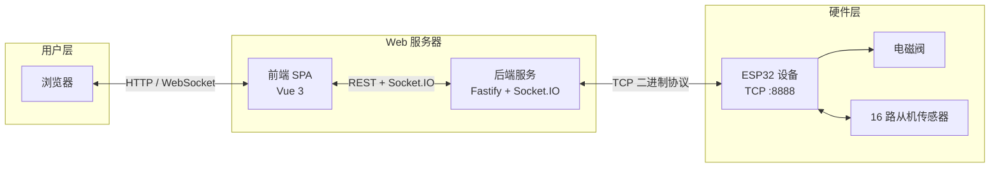
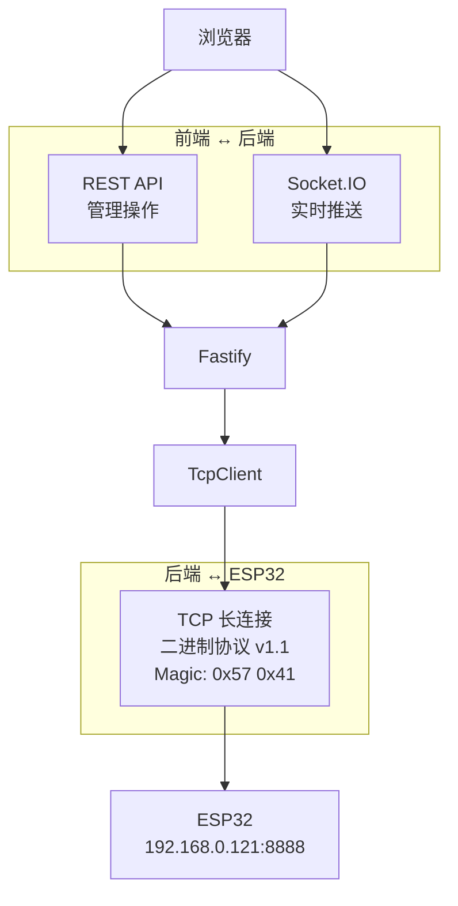
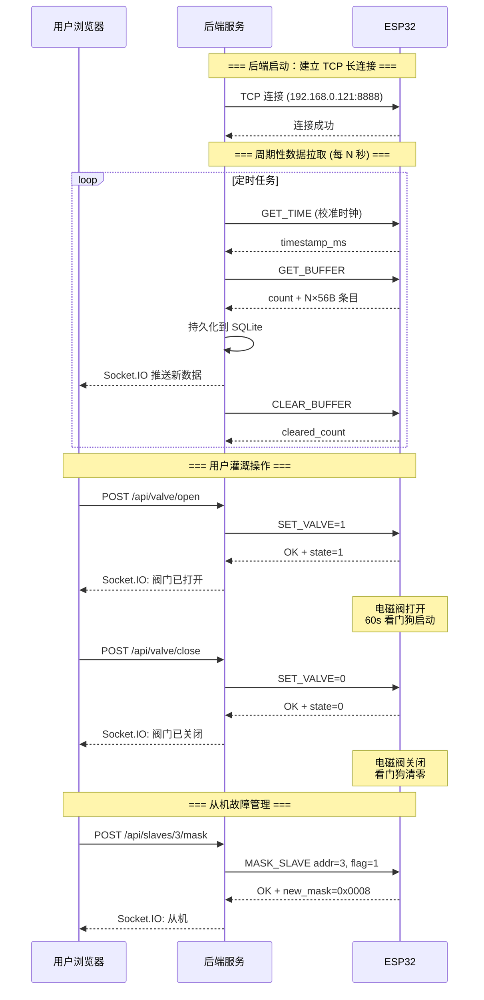
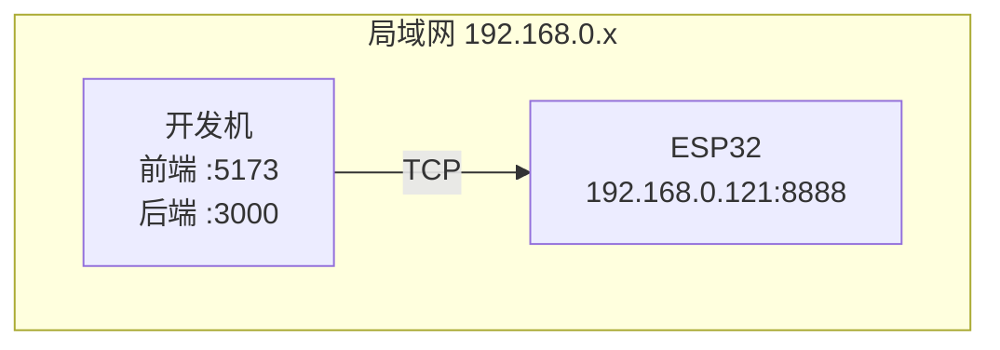

# 系统架构与项目结构

> **文档日期**: 2026-07-26  
> **项目**: ESP32 自动灌溉系统 — Web 控制面板  
> **协议参考**: `external-docs/tcp-binary-protocol.md` v1.1

---

## 目录

1. [系统总览](#1-系统总览)
2. [项目结构](#2-项目结构)
3. [技术栈](#3-技术栈)
4. [通信架构](#4-通信架构)
5. [数据流总览](#5-数据流总览)
6. [部署视图](#6-部署视图)
7. [决策日志](#7-决策日志)

---

## 1. 系统总览

本项目是 ESP32 自动灌溉系统的 **Web 控制面板**，运行在局域网内的 PC/服务器上，为用户提供：

- 电磁阀远程开关控制
- 16 路从机传感器的实时/历史数据查看
- 从机故障屏蔽管理
- 灌溉调度（后续规划）

系统由三个软件层和一个硬件层构成：



**核心交互模式**：

| 方向        | 说明                                                                                        |
| ----------- | ------------------------------------------------------------------------------------------- |
| 用户 → 硬件 | 用户通过 Web 界面发出指令，经后端转换为 TCP 二进制命令发往 ESP32，ESP32 驱动硬件执行        |
| 硬件 → 用户 | ESP32 定时采集传感器数据存入缓冲区，后端周期拉取并持久化，通过 Socket.IO 实时推送至前端展示 |

---

## 2. 项目结构

项目采用 **pnpm workspace monorepo**，根目录位于 `packages/web/water/`。

```
water/
├── pnpm-workspace.yaml          # pnpm monorepo 配置
├── pnpm-lock.yaml
├── temp.yaml                     # (非项目文件，忽略)
├── docs/                         # 📖 项目文档 (本文档所在)
├── external-docs/                # 📄 外部参考材料 (只读)
│   └── tcp-binary-protocol.md    #   ESP32 TCP 二进制协议 v1.1 规格书
└── packages/
    ├── frontend/                 # 🖥️ 前端 — Vue 3 SPA
    │   ├── src/
    │   │   ├── main.ts           #   应用入口 (挂载 Pinia + Router)
    │   │   ├── App.vue           #   根组件
    │   │   ├── router/           #   路由配置
    │   │   └── stores/           #   Pinia 状态管理
    │   └── vite.config.ts
    ├── backend/                  # ⚙️ 后端 — Node.js 服务
    │   └── src/
    │       ├── main.ts           #   服务入口 (待实现)
    │       └── tcp/              #   TCP 二进制协议客户端
    │           ├── tcp-client.ts #     TcpClient 主类
    │           ├── crc16.ts      #     CRC-16-CCITT 校验
    │           ├── types.ts      #     协议常量与类型
    │           └── commands/     #     7 条命令的独立模块
    └── shared/                   # 🔗 共享类型与工具
        └── src/
            └── index.ts          #   共享导出 (待实现)
```

### 各包职责

| 包         | 职责                                                       | 依赖关系             |
| ---------- | ---------------------------------------------------------- | -------------------- |
| `frontend` | 用户界面：阀门控制、数据展示、从机管理                     | 依赖 `shared` (类型) |
| `backend`  | 业务逻辑层：REST API、Socket.IO 推送、TCP 通信、数据持久化 | 依赖 `shared` (类型) |
| `shared`   | 前后端共享的 TypeScript 类型定义与常量                     | 无依赖               |

---

## 3. 技术栈

### frontend

| 类别     | 选型                    | 用途                               |
| -------- | ----------------------- | ---------------------------------- |
| 框架     | Vue 3 (Composition API) | SPA 页面渲染与交互                 |
| 构建     | Vite 8                  | 开发服务器与生产构建               |
| 语言     | TypeScript ~6.0         | 类型安全                           |
| 路由     | Vue Router 5            | 客户端路由                         |
| 状态管理 | Pinia 4                 | 全局状态（设备状态、传感器数据等） |
| Lint     | ESLint + Oxlint         | 代码质量                           |

### backend

| 类别      | 选型                  | 用途                                |
| --------- | --------------------- | ----------------------------------- |
| 运行时    | Node.js ≥22.18        | 服务器运行时                        |
| 语言      | TypeScript 7          | 类型安全                            |
| HTTP 框架 | Fastify 5             | REST API 服务                       |
| 实时通信  | Socket.IO 4           | 浏览器 ↔ 服务器双向实时推送         |
| ORM       | Sequelize 7 + SQLite3 | 数据持久化 (调度记录、传感器历史等) |
| TCP       | Node.js `net` 模块    | 与 ESP32 的二进制协议通信           |

### shared

| 类别 | 选型            | 用途           |
| ---- | --------------- | -------------- |
| 语言 | TypeScript ~6.0 | 共享类型与常量 |

---

## 4. 通信架构

系统采用 **两层通信模型**：一层面向用户（HTTP + WebSocket），一层面向设备（TCP 二进制协议）。



### 4.1 前端 ↔ 后端：混合模式

| 通道          | 适用场景                 | 示例                                               |
| ------------- | ------------------------ | -------------------------------------------------- |
| **REST API**  | 一次性的管理操作         | 开关阀门、屏蔽/取消屏蔽从机、清空缓冲区            |
| **Socket.IO** | 服务端主动推送的实时数据 | 传感器脉冲计数更新、阀门状态变化、设备时间同步状态 |

> 选型理由：管理操作天然适合请求-响应模型；传感器数据需要持续推送，避免前端轮询带来的带宽和延迟开销。

### 4.2 后端 ↔ ESP32：TCP 二进制协议

后端通过 `TcpClient` 类维护与 ESP32 的 TCP 长连接，使用自定义二进制协议通信。

**协议概要**：

| 属性   | 值                                   |
| ------ | ------------------------------------ |
| 传输层 | TCP (ESP32 监听端口 8888)            |
| 帧同步 | 固定 Magic Number `0x57 0x41` ("WA") |
| 字节序 | Little-Endian (ESP32 原生序)         |
| 校验   | CRC-16-CCITT (多项式 `0x1021`)       |
| 模式   | 请求-响应，一问一答                  |

**帧结构**：

```
请求帧: [Magic:2] [Seq:1] [Cmd:1] [Len:2 LE] [Payload:N] [CRC16:2 LE]
响应帧: [Magic:2] [Seq:1] [Status:1] [Len:2 LE] [Payload:N] [CRC16:2 LE]
```

**命令速览**：

| 命令码 | 名称           | 用途                                |
| :----: | -------------- | ----------------------------------- |
| `0x01` | `GET_TIME`     | 获取 ESP32 当前时间戳               |
| `0x02` | `GET_BUFFER`   | 拉取缓冲区中全部传感器采集数据      |
| `0x03` | `CLEAR_BUFFER` | 清空缓冲区                          |
| `0x04` | `GET_VALVE`    | 查询电磁阀状态                      |
| `0x05` | `SET_VALVE`    | 开关电磁阀（开启后触发 60s 看门狗） |
| `0x06` | `MASK_SLAVE`   | 屏蔽/取消屏蔽指定从机传感器         |
| `0x07` | `GET_MASK`     | 查询当前从机屏蔽位图                |

> 协议完整规格（字段定义、CRC 算法、错误码、BufferEntry 格式等）见 [`external-docs/tcp-binary-protocol.md`](../external-docs/tcp-binary-protocol.md)。

**TcpClient 设计要点**：

- **命令模式封装**：每条命令独立为 `commands/` 下的一个模块（`buildPayload` + `parseResponse`），`TcpClient` 负责帧组装/解析、CRC 校验、序列号管理
- **粘包/半包处理**：通过 Magic Number 定位帧边界，接收缓冲区累积数据直到完整帧到达
- **超时控制**：连接超时和命令响应超时均可配置（默认 5s）

### 4.3 典型交互时序



---

## 5. 数据流总览

### 5.1 传感器数据流（上行）

```
ESP32 定时采集 → 写入缓冲区 → 后端 GET_BUFFER 拉取 → SQLite 持久化 → Socket.IO 推送前端
```

- ESP32 以固定频率采集 16 路从机的脉冲计数，附加 CRC-8 校验后写入内部缓冲区（最大 512 条）
- 后端通过定时任务调用 `GET_BUFFER` → `CLEAR_BUFFER`，确保 at-most-once 语义（若拉取后网络中断未清空，下次仍可获取相同数据）
- 拉取的数据持久化到 SQLite，用于历史趋势分析
- 通过 Socket.IO 实时推送增量数据至前端

### 5.2 控制指令流（下行）

```
前端操作 → REST API → 后端 TcpClient → TCP 二进制帧 → ESP32 → GPIO 驱动硬件
```

- 用户在前端触发操作（开关阀门、屏蔽从机）
- 后端收到 REST 请求后，调用 `TcpClient` 对应方法发送二进制命令
- ESP32 执行后返回状态码，后端根据结果向前端推送状态变更事件

### 5.3 安全约束

| 约束                 | 说明                                                                                                                    |
| -------------------- | ----------------------------------------------------------------------------------------------------------------------- |
| **阀门看门狗 (60s)** | `SET_VALVE=1` 后，ESP32 启动硬件看门狗。若 60s 内未收到 `SET_VALVE=0`，自动强制关闭电磁阀，防止因网络中断导致长时间漏水 |
| **从机屏蔽**         | 被屏蔽的从机数据仍正常采集，但不参与 SENSOR_FAULT 状态判断，避免已知故障从机干扰系统状态                                |
| **CRC 双重校验**     | 从机数据自带 CRC-8，协议帧带 CRC-16，两层校验保证数据完整性                                                             |

---

## 6. 部署视图

### 开发环境



- **开发机**：同时运行前端 Vite dev server (`:5173`) 和后端 Node.js 服务 (`:3000`)
- **ESP32**：通过 TCP (`192.168.0.121:8888`) 与后端通信
- **前端**：开发时通过 Vite proxy 将 API 请求转发至后端

> 生产部署方案（Docker、进程守护、反向代理等）将在后续 `development-guide.md` 中详细规划。

---

## 7. 决策日志

| #   | 决策                                              | 理由                                                                                                         | 日期    |
| --- | ------------------------------------------------- | ------------------------------------------------------------------------------------------------------------ | ------- |
| 1   | 采用 **pnpm workspace monorepo**                  | 前后端共享类型定义，统一依赖管理，避免多仓库同步问题                                                         | 2026-07 |
| 2   | 前端选型 **Vue 3 + Vite**                         | 生态成熟，Composition API 适合中大型应用，Vite 开发体验优于 Webpack                                          | 2026-07 |
| 3   | 后端选型 **Fastify + Socket.IO**                  | Fastify 性能优于 Express，Socket.IO 提供可靠的实时双向通信（自动降级、自动重连）                             | 2026-07 |
| 4   | 前端-后端通信采用 **REST + Socket.IO 混合模式**   | REST 适合一次性管理操作（语义清晰、可缓存）；Socket.IO 适合实时数据推送（避免轮询开销）                      | 2026-07 |
| 5   | TCP 协议客户端采用 **命令模式**（每命令独立模块） | `commands/` 下每条命令封装 `buildPayload` + `parseResponse`，新增命令只需新增文件，符合开闭原则              | 2026-07 |
| 6   | 数据持久化选型 **SQLite**（通过 Sequelize ORM）   | 灌溉系统数据量可控，SQLite 零配置、零运维，适合嵌入式/单机场景；Sequelize 提供未来迁移至 PostgreSQL 的灵活性 | 2026-07 |
| 7   | 全栈 **TypeScript**                               | 前后端及协议层共享类型，编译期捕获接口不匹配，减少运行时错误                                                 | 2026-07 |
| 8   | 传感器数据拉取采用 **Pull 模式**（后端定时拉取）  | ESP32 作为 TCP Server 被动响应，由后端控制拉取节奏，避免 ESP32 资源受限场景下的推送复杂性                    | 2026-07 |
