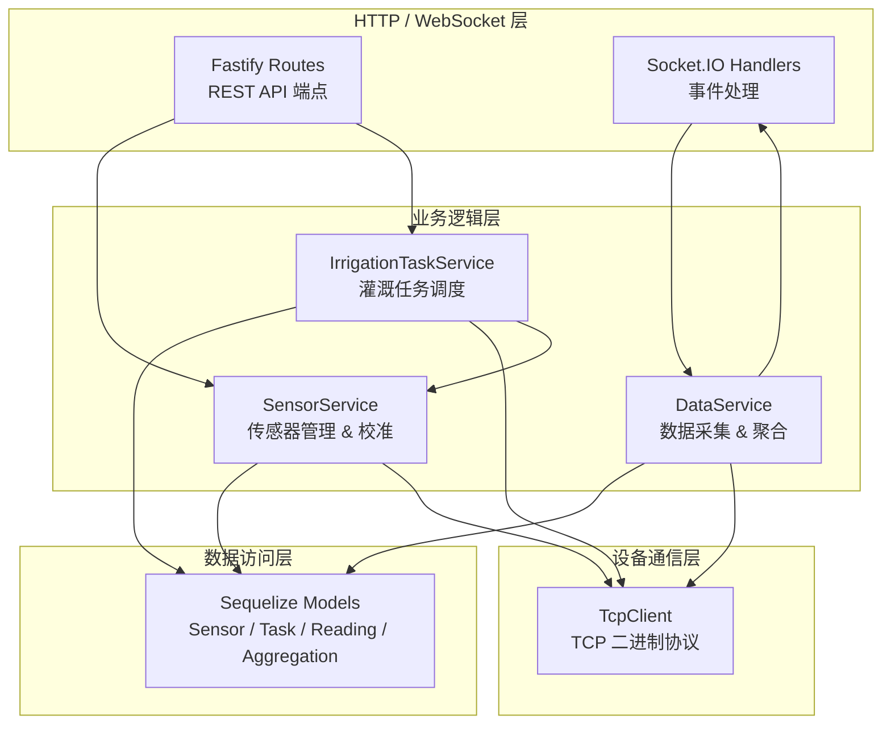
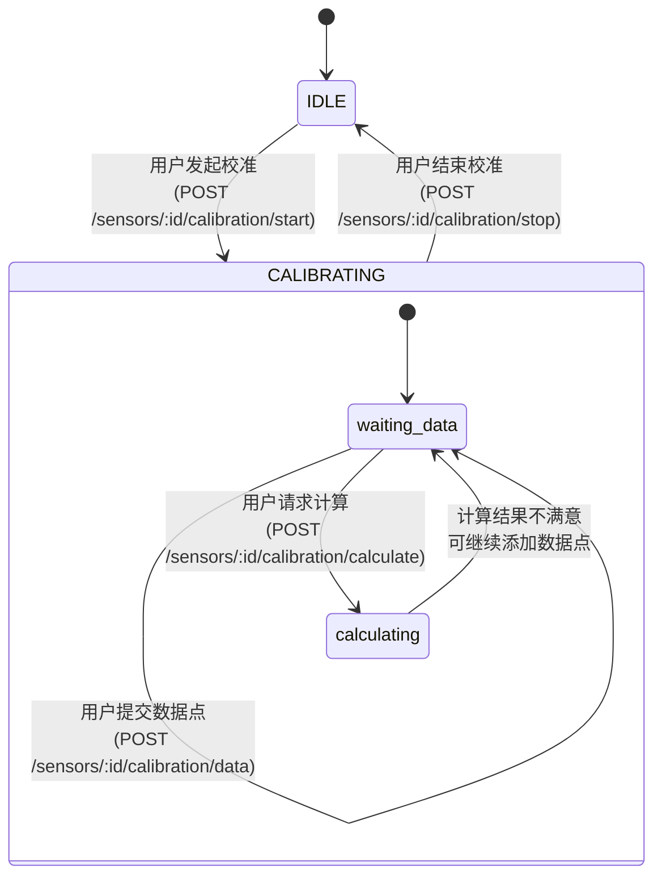
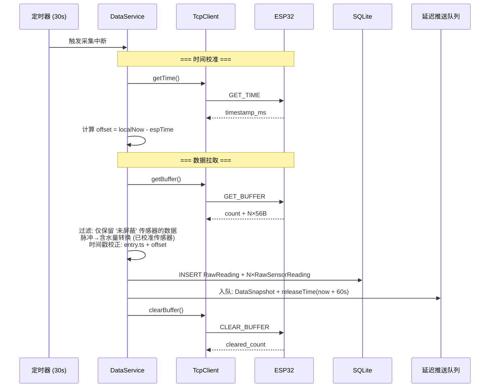
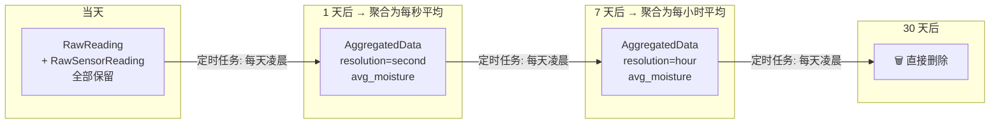
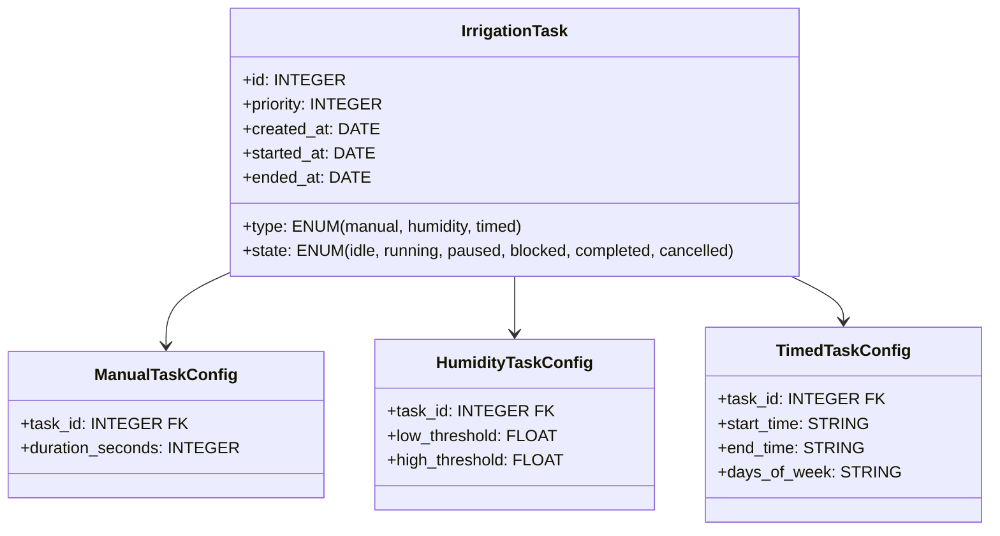
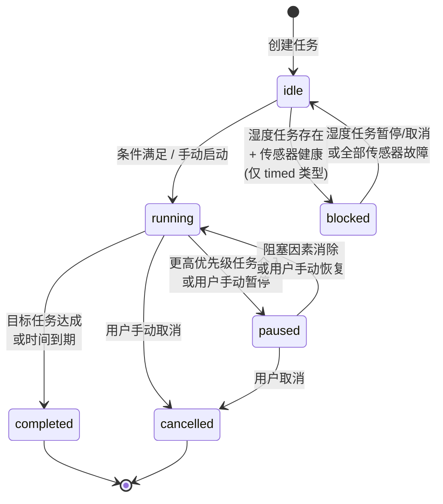

# 后端服务设计

> **文档日期**: 2026-07-26  
> **项目**: ESP32 自动灌溉系统 — Web 控制面板  
> **依赖**: `docs/architecture.md`、`external-docs/tcp-binary-protocol.md` v1.1

---

## 目录

1. [架构总览](#1-架构总览)
2. [传感器管理](#2-传感器管理)
3. [数据采集与持久化](#3-数据采集与持久化)
4. [灌溉任务管理](#4-灌溉任务管理)
5. [REST API 设计](#5-rest-api-设计)
6. [Socket.IO 事件设计](#6-socketio-事件设计)
7. [决策日志](#7-决策日志)

---

## 1. 架构总览

后端采用 **分层架构**，自顶向下分为三层：



### 1.1 启动流程

```
1. 初始化 Sequelize (连接 SQLite, 同步模型)
2. 创建 TcpClient 实例
3. 创建各 Service 实例 (注入 TcpClient + Models)
4. 注册 Fastify 路由
5. 绑定 Socket.IO 事件
6. 连接 ESP32 (TCP)
7. 校准 ESP32 时间 (GET_TIME, 计算与本地时间偏移量)
8. 同步传感器屏蔽位图到 ESP32
9. 启动 30s 数据采集定时器
10. 启动延迟推送定时器 (每秒从延迟队列推送数据至前端)
11. 启动灌溉任务调度循环
12. 启动数据清理定时器 (每日凌晨执行)
13. 启动 Fastify 监听 :3000
```

### 1.2 关键依赖注入关系

| 服务                    | 依赖                                                                                                   |
| ----------------------- | ------------------------------------------------------------------------------------------------------ |
| `SensorService`         | Sequelize Models (`Sensor`, `CalibrationPoint`), `TcpClient`                                           |
| `IrrigationTaskService` | Sequelize Models (`IrrigationTask`), `TcpClient`, `SensorService`                                      |
| `DataService`           | Sequelize Models (`RawReading`, `RawSensorReading`, `AggregatedData`), `TcpClient`, Socket.IO `Server` |

---

## 2. 传感器管理

### 3.1 抽象模型：ESP32 从机地址的反向抽象

ESP32 端固定 16 个从机槽位（地址 0~15），在其视角下传感器"始终存在"。后端**反向抽象**：

- 默认状态：**无传感器**
- 用户主动"添加传感器"，指定一个 ESP32 从机地址 (`slave_addr`) 与之绑定
- "删除传感器" → 从 DB 中移除记录，对应的 `slave_addr` 回归未使用状态
- "标记故障" → 传感器保留在 DB 中，但被屏蔽（不参与湿度计算，不触发湿度任务）

```
ESP32 视角:     [ #0 ] [ #1 ] [ #2 ] [ #3 ] ... [ #15 ]   ← 16 槽位始终存在
                   ↓      ↓      ↓      ↓           ↓
后端抽象:       故障   活跃     —     活跃    ...    —      ← 只有"已添加"的才存在
               (屏蔽)         (未添加)                 (未添加)
```

### 3.2 屏蔽位图同步策略

**屏蔽规则**：满足以下任一条件的 `slave_addr` 需要被屏蔽：

1. 用户未添加的地址（该地址不在 DB 中）
2. DB 中标记为 `faulty = true` 的地址

**同步触发时机**：

- 传感器新增/删除
- 传感器标记故障/取消故障
- 后端启动时（初始同步）

**同步逻辑** (`SensorService.syncMaskToEsp32()`)：

```
mask_bitmap = 0x0000
for addr in 0..15:
    sensor = DB.findBySlaveAddr(addr)
    if sensor == null or sensor.faulty:
        mask_bitmap |= (1 << addr)

# 逐一对 ESP32 发送 MASK_SLAVE addr=x, flag=1 (只发需要屏蔽的)
# 已添加的健康传感器统一发送 MASK_SLAVE addr=x, flag=0
```

### 3.3 Sensor 模型

| 字段              | 类型             | 说明                                   |
| ----------------- | ---------------- | -------------------------------------- |
| `id`              | INTEGER PK       | 自增主键                               |
| `slave_addr`      | INTEGER (0~15)   | ESP32 从机地址，唯一                   |
| `name`            | STRING           | 用户自定义名称 (如 "1号花盆")          |
| `faulty`          | BOOLEAN          | 是否标记为故障 (默认 false)            |
| `calibrated`      | BOOLEAN          | 是否已完成校准 (默认 false)            |
| `calib_slope`     | FLOAT (nullable) | 校准参数 a（具体模型待硬件实验后确定） |
| `calib_intercept` | FLOAT (nullable) | 校准参数 b（具体模型待硬件实验后确定） |
| `created_at`      | DATE             | 添加时间                               |

> 含水量转换（校准完成后启用）：利用 `calib_slope` 和 `calib_intercept` 将脉冲计数转换为含水量。
> 具体的转换数学模型（线性、多项式等）待传感器硬件完工后通过实验测定 `pulse_count` 与 `actual_moisture` 的分布规律来确定。
> 未校准的传感器不参与平均含水量计算，但原始脉冲数据正常记录。

### 3.4 校准流程

#### 3.4.1 校准模式状态机



#### 3.4.2 校准模式下的行为约束

| 行为       | 约束                                                       |
| ---------- | ---------------------------------------------------------- |
| 灌溉任务   | **全部暂停**。任何 RUNNING/ACTIVE 的任务切换到 PAUSED 状态 |
| 数据采集   | **继续运行**。30s 采集循环不中断（确保脉冲计数被记录）     |
| 新灌溉任务 | **拒绝创建/启动**，返回错误 `CALIBRATION_IN_PROGRESS`      |
| 并发校准   | **不允许**。同一时间只能有一个传感器处于校准模式           |

> 退出校准模式后，被暂停的任务按优先级规则自动恢复。

#### 3.4.3 校准数据采集

用户在物理环境中测量传感器的实际土壤含水量（如烘干称重法测得 25%），同时在 Web 界面输入该值。后端记录此时的脉冲计数。

**CalibrationPoint 模型**：

| 字段              | 类型       | 说明                                    |
| ----------------- | ---------- | --------------------------------------- |
| `id`              | INTEGER PK | 自增主键                                |
| `sensor_id`       | INTEGER FK | 关联 Sensor                             |
| `pulse_count`     | INTEGER    | 提交该数据点时最近一次采集的脉冲计数    |
| `actual_moisture` | FLOAT      | 用户输入的实际含水量 (如 0.25 表示 25%) |
| `created_at`      | DATE       | 记录时间                                |

**数据点提交流程**：

```
1. 用户 POST /calibration/data { actual_moisture: 0.25 }
2. 后端读取该传感器最近一次采集的 pulse_count (从 RawSensorReading)
3. 创建 CalibrationPoint(pulse_count, actual_moisture)
```

#### 3.4.4 校准公式计算

用户收集至少 2 个数据点后，可请求计算校准公式。后端使用最小二乘法进行回归拟合，将结果写入 `Sensor.calib_slope` 和 `Sensor.calib_intercept`，并设置 `calibrated = true`。

> **注意**：含水量与脉冲计数之间可能不是线性关系（如指数、对数或分段函数）。具体的拟合模型（线性回归、多项式回归等）需待传感器硬件完工后，通过实验测定 `pulse_count` 与 `actual_moisture` 的实际分布规律来确定。当前设计仅预留 `calib_slope` / `calib_intercept` 两个参数槽位作为通用占位——若后续实验验证为非线性关系，字段定义和计算逻辑均可替换。

### 3.5 传感器相关 REST API

| 方法     | 路径                                     | 说明                                   |
| -------- | ---------------------------------------- | -------------------------------------- |
| `GET`    | `/api/sensors`                           | 列出所有传感器（含校准状态、故障标记） |
| `POST`   | `/api/sensors`                           | 添加传感器 `{ slave_addr, name }`      |
| `DELETE` | `/api/sensors/:id`                       | 删除传感器                             |
| `PATCH`  | `/api/sensors/:id`                       | 更新传感器（名称、故障标记）           |
| `POST`   | `/api/sensors/:id/calibration/start`     | 进入校准模式                           |
| `POST`   | `/api/sensors/:id/calibration/stop`      | 退出校准模式                           |
| `POST`   | `/api/sensors/:id/calibration/data`      | 提交校准数据点 `{ actual_moisture }`   |
| `POST`   | `/api/sensors/:id/calibration/calculate` | 计算校准公式                           |
| `GET`    | `/api/sensors/:id/calibration`           | 查看校准状态与数据点列表               |

---

## 3. 数据采集与持久化

### 4.1 30 秒采集循环

每次采集循环包含两个阶段：**时间校准**与**数据拉取**。

#### 4.1.1 时间校准

每次采集循环的第一步是校准 ESP32 与后端的时间偏差。

**偏移量计算**：

$$
\text{offset} = \text{Date.now()} - \text{espTimestamp}
$$

- `espTimestamp` 来自 `GET_TIME` 响应
- `offset` 为正时表示 ESP32 时钟慢于本地时钟

**偏移量的使用**：

`GET_BUFFER` 返回的每条 `BufferEntry.timestampMs` 均为 ESP32 本地时钟记录的时间戳。采集时统一校正为：

$$
\text{correctedTs} = \text{entry.timestampMs} + \text{offset}
$$

校正后的时间戳即以后端本地时钟为基准的真实采集时刻，用于数据库存储和前端展示。

> 每次 30s 采集循环都重新计算 `offset`，以持续跟踪 ESP32 晶振漂移带来的累积误差。无论 ESP32 的 NTP 是否同步、时间戳是绝对还是相对值，差值校正均适用——只要 ESP32 内部时钟单调递增即可。

#### 4.1.2 采集流程



> **关键变更**：数据采集后不再直接 `emit` 到 Socket.IO，而是放入延迟推送队列（见 4.4.1）。

### 4.2 数据模型

#### RawReading（当天原始数据 — 母表）

| 字段           | 类型             | 说明                             |
| -------------- | ---------------- | -------------------------------- |
| `id`           | INTEGER PK       | 自增主键                         |
| `timestamp`    | DATE             | 采集时刻（精确到秒）             |
| `avg_moisture` | FLOAT (nullable) | 所有已校准健康传感器的平均含水量 |
| `valve_state`  | INTEGER          | 采集时的电磁阀状态 (0/1)         |
| `created_at`   | DATE             | 记录创建时间                     |

#### RawSensorReading（当天单传感器明细 — 子表）

| 字段          | 类型             | 说明                              |
| ------------- | ---------------- | --------------------------------- |
| `id`          | INTEGER PK       | 自增主键                          |
| `reading_id`  | INTEGER FK       | 关联 RawReading                   |
| `sensor_id`   | INTEGER FK       | 关联 Sensor                       |
| `slave_addr`  | INTEGER          | 从机地址 (冗余，便于查询)         |
| `pulse_count` | INTEGER          | 原始脉冲计数                      |
| `moisture`    | FLOAT (nullable) | 转换后的含水量（未校准则为 null） |
| `crc8_valid`  | BOOLEAN          | CRC-8 校验是否通过                |

#### AggregatedData（聚合后数据）

| 字段           | 类型       | 说明                             |
| -------------- | ---------- | -------------------------------- |
| `id`           | INTEGER PK | 自增主键                         |
| `timestamp`    | DATE       | 聚合时间点                       |
| `resolution`   | STRING     | `second` 或 `hour`               |
| `avg_moisture` | FLOAT      | 时间窗口内所有采集点的平均含水量 |

### 4.3 数据保留策略



| 数据年龄     | 存储内容                            | 粒度                      |
| ------------ | ----------------------------------- | ------------------------- |
| 当天 (≤1 天) | `RawReading` + `RawSensorReading`   | 每条采集记录（~30s 间隔） |
| 1~7 天       | `AggregatedData(resolution=second)` | 每秒一条平均含水量        |
| 7~30 天      | `AggregatedData(resolution=hour)`   | 每小时一条平均含水量      |
| >30 天       | 删除                                | —                         |

**聚合规则**：

- `resolution=second`：将当天所有同一秒内的 `RawReading` 取 `avg_moisture` 平均，生成一条 `AggregatedData`
- `resolution=hour`：将 7 天前所有同一小时内的 `AggregatedData(second)` 取 `avg_moisture` 平均

**清理任务**：每日凌晨 02:00 执行，依次：

1. 将昨天数据聚合为 `second` 精度 → 删除昨天的 `RawReading` + `RawSensorReading`
2. 将 8 天前数据聚合为 `hour` 精度 → 删除 8 天前的 `AggregatedData(second)`
3. 删除 30 天前的 `AggregatedData(hour)`

### 4.4 Socket.IO 实时推送

#### 4.4.1 延迟推送队列

由于 ESP32 每 30 秒才产生一条采集数据，前端若直接以 30 秒间隔接收数据点，图表绘制会出现明显的跳跃感。因此后端引入 **60 秒延迟推送队列**，以平滑的数据流输出至前端。

**设计思路**：

```
采集 (30s间隔)  →  延迟队列 (60s缓冲)  →  每秒推送 (1s间隔)  →  前端 (流畅渲染)
```

- 每条采集到的 `DataSnapshot` 进入队列时标记 `releaseTime = now + 60,000ms`
- 独立的 **1 秒定时器** 不断检查队列，将 `releaseTime` 已到的数据点逐个推送至前端
- 推送速率 = 每秒最多 1 条
- 队列空时，该秒不推送任何内容

**效果**：

```mermaid
gantt
    title 延迟推送时间线示例
    dateFormat X
    axisFormat %s

    section 采集
    采集点 A (T=0)    :done, a1, 0, 1
    采集点 B (T=30)   :done, a2, 30, 31
    采集点 C (T=60)   :done, a3, 60, 61

    section 延迟队列 (60s)
    A 等待中           :b1, 1, 59
    B 等待中           :b2, 31, 89
    C 等待中           :b3, 61, 119

    section 推送 (1s间隔)
    推送 A             :milestone, c1, 60, 1
    推送 B             :milestone, c2, 90, 1
    推送 C             :milestone, c3, 120, 1
```



> 前端收到的数据始终滞后真实时间约 60 秒。对于灌溉系统而言，1 分钟延迟完全可接受——灌溉决策的时效性要求远低于秒级。

**边缘情况处理**：

| 场景                     | 处理                                                                                        |
| ------------------------ | ------------------------------------------------------------------------------------------- |
| 前端刚连接               | 推送队列中已有的待推送数据点（最多 60s 内的数据）全部立即推送，帮助前端快速填充图表         |
| 队列堆积（采集快于推送） | 队列仅保留最近 5 分钟的待推送数据，超过则丢弃最旧数据点，防止内存无限增长                   |
| 后端重启                 | 延迟队列为内存结构，重启后清空。前端在重连后通过 REST API 拉取最近 5 分钟的历史数据补全图表 |

#### 4.4.2 推送事件

```typescript
{
    timestamp: number; // 采集时刻 Unix 时间戳
    avgMoisture: number | null; // 平均含水量 (nullable)
    valveState: 0 | 1; // 电磁阀状态
    sensors: Array<{
        sensorId: number;
        name: string;
        slaveAddr: number;
        pulseCount: number;
        moisture: number | null; // 单传感器含水量 (nullable)
        crc8Valid: boolean;
    }>;
}
```

---

## 4. 灌溉任务管理

### 5.1 三类任务模型



### 5.2 IrrigationTask 模型

| 字段                   | 类型                  | 说明                                                                  |
| ---------------------- | --------------------- | --------------------------------------------------------------------- |
| `id`                   | INTEGER PK            | 自增主键                                                              |
| `type`                 | ENUM                  | `manual` / `humidity` / `timed`                                       |
| `state`                | ENUM                  | `idle` / `running` / `paused` / `blocked` / `completed` / `cancelled` |
| `priority`             | INTEGER               | 0=MANUAL(最高) / 1=HUMIDITY / 2=TIMED(最低)                           |
| `suspended_by_task_id` | INTEGER FK (nullable) | 被哪个高优先级任务暂停（仅在 `paused` 状态时有值）                    |
| `created_at`           | DATE                  | 创建时间                                                              |
| `started_at`           | DATE (nullable)       | 实际开始运行时间                                                      |
| `ended_at`             | DATE (nullable)       | 结束时间                                                              |

#### ManualTaskConfig

| 字段               | 类型            | 说明                             |
| ------------------ | --------------- | -------------------------------- |
| `task_id`          | INTEGER FK (PK) | 关联 IrrigationTask              |
| `duration_seconds` | INTEGER         | 灌溉持续时长（秒），到期自动结束 |

#### HumidityTaskConfig

| 字段             | 类型            | 说明                                          |
| ---------------- | --------------- | --------------------------------------------- |
| `task_id`        | INTEGER FK (PK) | 关联 IrrigationTask                           |
| `low_threshold`  | FLOAT           | 当 `avg_moisture < low_threshold` 时启动灌溉  |
| `high_threshold` | FLOAT           | 当 `avg_moisture > high_threshold` 时停止灌溉 |

> 湿度任务只能存在一个。创建第二个时返回 `DUPLICATE_HUMIDITY_TASK` 错误。

#### TimedTaskConfig

| 字段           | 类型            | 说明                                          |
| -------------- | --------------- | --------------------------------------------- |
| `task_id`      | INTEGER FK (PK) | 关联 IrrigationTask                           |
| `start_time`   | STRING          | 每天开始时间 (HH:mm)                          |
| `end_time`     | STRING          | 每天结束时间 (HH:mm)                          |
| `days_of_week` | STRING          | 重复日 (JSON 数组, 如 `[1,3,5]` 表示周一三五) |

> 定时任务之间时间不能重叠。创建时后端校验，若与已有定时任务窗口重叠则返回 `TIME_CONFLICT`。

### 5.3 任务状态机



### 5.4 优先级调度规则

#### 规则 1：手动任务抢占

```
manual.running → 暂停所有其他 RUNNING 任务
manual.completed/cancelled → 恢复所有被 manual 暂停的任务
```

被暂停的任务记录 `suspended_by_task_id`，用于恢复时判断是否仍有其他阻塞因素。

#### 规则 2：湿度任务阻塞定时任务

```
humidity.idle/running/paused (存在且状态非 completed/cancelled)
  AND 至少一个传感器 healthy (非故障)
    → 所有 timed 任务进入 blocked 状态

humidity.cancelled/completed
  OR 全部传感器 faulty
    → 所有 timed 任务解除 blocked，回到 idle 状态
```

> 这意味着：只要湿度任务存在且系统能感知土壤含水量，定时任务就永不执行。这避免了湿度任务和定时任务冲突导致过度灌溉。

#### 规则 3：传感器依赖

| 任务类型   | 依赖传感器  | 全传感器故障时                   |
| ---------- | ----------- | -------------------------------- |
| `manual`   | ❌ 不依赖   | 仍可正常启动（用户直接控制阀门） |
| `humidity` | ✅ 强制依赖 | 自动暂停，`avg_moisture` 不可用  |
| `timed`    | ❌ 不依赖   | 仍可按时间表执行                 |

### 5.5 调度循环

调度器以 **每秒** 频率运行，检查以下条件：

```
1. 扫描所有 manual 任务:
   - running 的任务: 检查是否超过 duration  → completed

2. 扫描 humidity 任务:
   - idle: 若有健康传感器 && avg_moisture < low_threshold → running (开阀门)
   - running: avg_moisture > high_threshold → completed (关阀门)
   - 全传感器故障 → paused

3. 扫描所有 timed 任务:
   - 检查是否应被 humidity 阻塞 → blocked/idle
   - idle: 当前时间在 start_time~end_time 范围内 → running (开阀门)
   - running: 当前时间超过 end_time → completed (关阀门)

4. 处理阀门:
   - 任何 manual.running → 阀门=1
   - 否则 任何 humidity.running → 阀门=1
   - 否则 任何 timed.running → 阀门=1
   - 否则 → 阀门=0
```

### 5.6 灌溉任务相关 REST API

| 方法     | 路径                    | 说明                                               |
| -------- | ----------------------- | -------------------------------------------------- |
| `GET`    | `/api/tasks`            | 列出所有任务                                       |
| `POST`   | `/api/tasks`            | 创建任务 `{ type, config }`                        |
| `PUT`    | `/api/tasks/:id`        | 更新任务配置（仅 idle/paused 状态可更新）          |
| `DELETE` | `/api/tasks/:id`        | 删除任务（仅 idle/completed/cancelled 状态可删除） |
| `POST`   | `/api/tasks/:id/start`  | 手动启动任务（manual 类型）                        |
| `POST`   | `/api/tasks/:id/pause`  | 暂停任务                                           |
| `POST`   | `/api/tasks/:id/resume` | 恢复任务                                           |
| `POST`   | `/api/tasks/:id/cancel` | 取消任务                                           |
| `POST`   | `/api/tasks/:id/stop`   | 手动结束任务（manual 类型）                        |

---

## 5. REST API 设计

### 6.1 完整路由表

#### 传感器

| 方法     | 路径               | 请求体                 | 响应          | 说明                            |
| -------- | ------------------ | ---------------------- | ------------- | ------------------------------- |
| `GET`    | `/api/sensors`     | —                      | `Sensor[]`    | 列表                            |
| `POST`   | `/api/sensors`     | `{ slave_addr, name }` | `Sensor`      | 添加（触发屏蔽同步）            |
| `DELETE` | `/api/sensors/:id` | —                      | `{ deleted }` | 删除（触发屏蔽同步）            |
| `PATCH`  | `/api/sensors/:id` | `{ name?, faulty? }`   | `Sensor`      | 更新（faulty 变更触发屏蔽同步） |

#### 校准

| 方法   | 路径                                     | 请求体                | 响应                   | 说明                             |
| ------ | ---------------------------------------- | --------------------- | ---------------------- | -------------------------------- |
| `POST` | `/api/sensors/:id/calibration/start`     | —                     | `{ status }`           | 进入校准模式（暂停所有灌溉任务） |
| `POST` | `/api/sensors/:id/calibration/stop`      | —                     | `{ status }`           | 退出校准模式（恢复灌溉任务）     |
| `POST` | `/api/sensors/:id/calibration/data`      | `{ actual_moisture }` | `CalibrationPoint`     | 提交校准数据点                   |
| `POST` | `/api/sensors/:id/calibration/calculate` | —                     | `{ slope, intercept }` | 计算校准公式                     |
| `GET`  | `/api/sensors/:id/calibration`           | —                     | `{ points, formula }`  | 查看校准状态与历史数据点         |

#### 灌溉任务

| 方法     | 路径                    | 请求体             | 响应               | 说明                    |
| -------- | ----------------------- | ------------------ | ------------------ | ----------------------- |
| `GET`    | `/api/tasks`            | —                  | `IrrigationTask[]` | 列表（含当前状态）      |
| `POST`   | `/api/tasks`            | `{ type, config }` | `IrrigationTask`   | 创建                    |
| `PUT`    | `/api/tasks/:id`        | `{ config }`       | `IrrigationTask`   | 更新配置                |
| `DELETE` | `/api/tasks/:id`        | —                  | `{ deleted }`      | 删除                    |
| `POST`   | `/api/tasks/:id/start`  | —                  | `IrrigationTask`   | 手动启动（manual 类型） |
| `POST`   | `/api/tasks/:id/pause`  | —                  | `IrrigationTask`   | 暂停                    |
| `POST`   | `/api/tasks/:id/resume` | —                  | `IrrigationTask`   | 恢复                    |
| `POST`   | `/api/tasks/:id/cancel` | —                  | `IrrigationTask`   | 取消                    |
| `POST`   | `/api/tasks/:id/stop`   | —                  | `IrrigationTask`   | 手动结束（manual 类型） |

#### 系统

| 方法  | 路径                 | 请求体 | 响应           | 说明                                                   |
| ----- | -------------------- | ------ | -------------- | ------------------------------------------------------ |
| `GET` | `/api/system/status` | —      | `SystemStatus` | 综合状态（阀门、活跃任务、传感器健康、ESP32 连接状态） |
| `GET` | `/api/system/valve`  | —      | `{ state }`    | 阀门当前状态                                           |

### 6.2 通用响应格式

```typescript
// 成功
{ "success": true, "data": T }

// 错误
{
    "success": false,
    "error": {
        "code": "CALIBRATION_IN_PROGRESS",
        "message": "传感器正在校准中，无法执行此操作"
    }
}
```

### 6.3 错误码清单

| 错误码                       | HTTP 状态码 | 说明                           |
| ---------------------------- | ----------- | ------------------------------ |
| `SENSOR_NOT_FOUND`           | 404         | 传感器不存在                   |
| `SLAVE_ADDR_TAKEN`           | 409         | 该从机地址已被其他传感器占用   |
| `SLAVE_ADDR_INVALID`         | 400         | 从机地址超出 0~15 范围         |
| `CALIBRATION_IN_PROGRESS`    | 409         | 已有传感器在校准中             |
| `SENSOR_ALREADY_CALIBRATING` | 409         | 该传感器已在校准中             |
| `NOT_CALIBRATING`            | 400         | 传感器未处于校准模式           |
| `INSUFFICIENT_CALIB_DATA`    | 400         | 数据点不足（<2 个），无法计算  |
| `TASK_NOT_FOUND`             | 404         | 灌溉任务不存在                 |
| `DUPLICATE_HUMIDITY_TASK`    | 409         | 已存在一个湿度任务             |
| `TIME_CONFLICT`              | 409         | 定时任务时间窗口与已有任务重叠 |
| `TASK_CANNOT_START`          | 400         | 任务当前状态不允许启动         |
| `TASK_CANNOT_UPDATE`         | 400         | 任务当前状态不允许更新配置     |
| `ESP_NOT_CONNECTED`          | 503         | ESP32 未连接                   |

---

## 6. Socket.IO 事件设计

### 7.1 服务端 → 客户端（推送）

| 事件名                    | 触发时机                                | Payload                                 |
| ------------------------- | --------------------------------------- | --------------------------------------- |
| `data:new`                | 每秒从延迟队列释放时 (滞后采集时刻 60s) | `DataSnapshot` (见 4.4.2)               |
| `valve:changed`           | 电磁阀状态变更                          | `{ state: 0\|1, triggeredBy: string }`  |
| `task:changed`            | 任务状态变更                            | `IrrigationTask` (完整任务对象)         |
| `sensor:changed`          | 传感器增删/故障标记/校准完成            | `Sensor` (完整传感器对象)               |
| `calibration:started`     | 进入校准模式                            | `{ sensorId: number }`                  |
| `calibration:stopped`     | 退出校准模式                            | `{ sensorId: number }`                  |
| `system:esp_connected`    | ESP32 TCP 连接建立                      | `{ timestamp: number }`                 |
| `system:esp_disconnected` | ESP32 TCP 连接断开                      | `{ timestamp: number, reason: string }` |
| `system:error`            | 系统级异常                              | `{ code: string, message: string }`     |

### 7.2 客户端 → 服务端

| 事件名 | 用途 | Payload                              |
| ------ | ---- | ------------------------------------ |
| 暂无   | —    | 当前所有客户端请求通过 REST API 发起 |

> Socket.IO 在本阶段仅用于服务端到客户端的单向推送。后续如需双向实时交互（如校准数据点实时预览），可在此扩展。

---

## 7. 决策日志

| #   | 决策                                                                    | 理由                                                                                                                                                                                                                 | 日期       |
| --- | ----------------------------------------------------------------------- | -------------------------------------------------------------------------------------------------------------------------------------------------------------------------------------------------------------------- | ---------- |
| 1   | 传感器采用 **反向抽象**（默认无传感器，用户添加）                       | 与用户的直觉模型一致；ESP32 端的 16 槽位是物理约束而非业务需求，后端不应将物理细节暴露给用户                                                                                                                         | 2026-07-26 |
| 2   | 屏蔽位图 **由后端计算并同步到 ESP32**                                   | 保持单一真相源。未添加 + 故障 = 屏蔽，规则集中在一处，避免前端/ESP32 两端状态不一致                                                                                                                                  | 2026-07-26 |
| 3   | 校准期间 **暂停所有灌溉任务**                                           | 校准需要稳定的传感器读数环境，灌溉会导致土壤含水量变化，干扰校准数据准确性                                                                                                                                           | 2026-07-26 |
| 4   | 校准公式计算 **延后到用户主动请求**                                     | 数据点和计算分离，允许用户逐步收集数据点、观察趋势后再决定是否应用公式。避免每新增一个点就重新拟合导致频繁变更                                                                                                       | 2026-07-26 |
| 5   | 分层数据保留策略：**当天详细 → 1天后秒级 → 7天后小时级 → 30天删除**     | 平衡存储开销与查询需求。近期数据细粒度支持问题排查，远期数据粗粒度满足趋势分析                                                                                                                                       | 2026-07-26 |
| 6   | **Pull 模式**采集（后端定时拉取）                                       | ESP32 资源受限，被动响应 TCP 请求是最小开销方案。后端控制拉取节奏，避免 ESP32 缓冲区溢出                                                                                                                             | 2026-07-26 |
| 7   | 灌溉任务优先级 **MANUAL > HUMIDITY > TIMED**                            | 手动任务代表用户即时意图，优先级最高；湿度任务代表自动化节水需求，次之；定时任务为兜底策略，优先级最低                                                                                                               | 2026-07-26 |
| 8   | 湿度任务存在+传感器健康时 **永久阻塞定时任务**（而非跳过单次）          | 避免两个自动化策略同时生效导致过度灌溉。湿度任务能根据实际土壤状况精确控制，定时任务是盲灌溉，前者存在时后者无意义                                                                                                   | 2026-07-26 |
| 9   | 手动/定时任务 **不依赖传感器**                                          | 用户可能在传感器全部损坏时仍需应急灌溉（手动），或依靠天气预报按固定时间灌溉（定时）。灌溉不是传感器功能的下位依赖                                                                                                   | 2026-07-26 |
| 10  | 灌溉调度器 **每秒轮询**                                                 | 30s 采集间隔对于阀门控制来说太慢（60s 看门狗内仅够 2 次采集），1s 轮询保证能在秒级响应湿度阈值触发和定时任务起始                                                                                                     | 2026-07-26 |
| 11  | Socket.IO **仅服务端推送**（当前阶段）                                  | 所有写操作通过 REST API（审计、幂等、错误处理更清晰）；Socket.IO 专注于实时状态同步                                                                                                                                  | 2026-07-26 |
| 12  | 采集循环中加入 **ESP32 时间校准**（每次 30s 均重新计算偏移量 `offset`） | ESP32 内部时钟与后端时钟必然存在偏差（晶振漂移、上电时间不同等）。每次采集时计算 `offset = Date.now() - espTimestamp`，用该差值校正所有 BufferEntry 的时间戳。此方法不依赖 NTP 同步状态，只要 ESP32 时钟单调递增即可 | 2026-07-26 |
| 13  | 前端推送采用 **60 秒延迟队列 + 每秒推送**                               | 30s 采集间隔直接推送会导致前端图表跳跃；延迟队列将不规则的采集点转化为 1s 间隔的平滑数据流，提升用户体验。1 分钟延迟对灌溉场景无实质影响                                                                             | 2026-07-26 |
