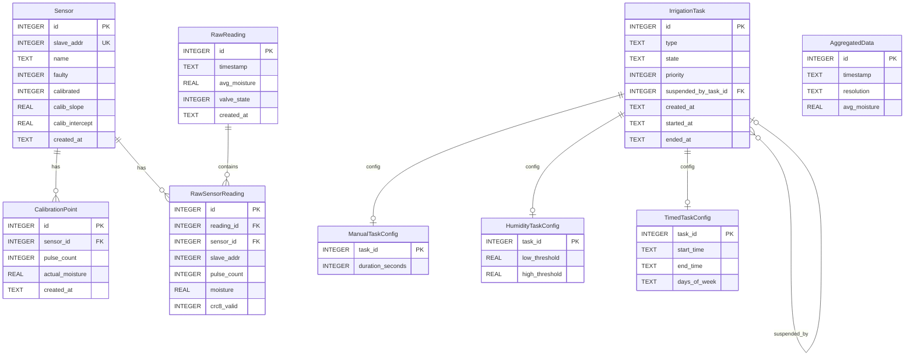
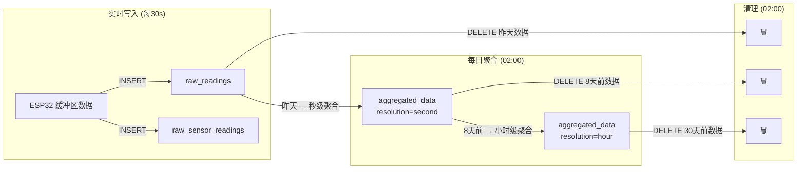

# 数据库设计

> **文档日期**: 2026-07-26  
> **项目**: ESP32 自动灌溉系统 — Web 控制面板  
> **依赖**: `docs/backend-design.md`  
> **数据库**: SQLite（通过 Sequelize 7 访问）

---

## 目录

1. [实体关系图](#1-实体关系图)
2. [表定义](#2-表定义)
3. [索引设计](#3-索引设计)
4. [数据生命周期](#4-数据生命周期)
5. [决策日志](#5-决策日志)

---

## 1. 实体关系图



### 1.1 表域分组

| 域           | 表                                                                            | 职责                           |
| ------------ | ----------------------------------------------------------------------------- | ------------------------------ |
| **传感器域** | `Sensor`, `CalibrationPoint`                                                  | 传感器注册、故障标记、校准数据 |
| **数据域**   | `RawReading`, `RawSensorReading`, `AggregatedData`                            | 采集数据存储与历史聚合         |
| **灌溉域**   | `IrrigationTask`, `ManualTaskConfig`, `HumidityTaskConfig`, `TimedTaskConfig` | 灌溉任务定义与运行时状态       |

---

## 2. 表定义

> SQL 示例遵循 SQLite 方言。`INTEGER` 用于布尔值（0/1），`REAL` 用于浮点数，`TEXT` 用于字符串和日期时间。  
> 实际项目通过 Sequelize 模型定义，不直接编写 DDL。

### 2.1 Sensor — 传感器

| 列名              | 类型    | 约束                                  | 说明                                                      |
| ----------------- | ------- | ------------------------------------- | --------------------------------------------------------- |
| `id`              | INTEGER | PK, AUTOINCREMENT                     | 自增主键                                                  |
| `slave_addr`      | INTEGER | NOT NULL, UNIQUE, CHECK(0~15)         | ESP32 从机地址                                            |
| `name`            | TEXT    | NOT NULL                              | 用户自定义名称                                            |
| `faulty`          | INTEGER | NOT NULL, DEFAULT 0                   | 故障标记：0=正常，1=故障                                  |
| `calibrated`      | INTEGER | NOT NULL, DEFAULT 0                   | 校准状态：0=未校准，1=已完成                              |
| `calib_slope`     | REAL    | —                                     | 校准参数 a，校准前为 NULL（具体数学模型待硬件实验后确定） |
| `calib_intercept` | REAL    | —                                     | 校准参数 b，校准前为 NULL（具体数学模型待硬件实验后确定） |
| `created_at`      | TEXT    | NOT NULL, DEFAULT `(datetime('now'))` | 添加时间                                                  |

```sql
CREATE TABLE sensors (
    id              INTEGER PRIMARY KEY AUTOINCREMENT,
    slave_addr      INTEGER NOT NULL UNIQUE CHECK (slave_addr >= 0 AND slave_addr <= 15),
    name            TEXT    NOT NULL,
    faulty          INTEGER NOT NULL DEFAULT 0 CHECK (faulty IN (0, 1)),
    calibrated      INTEGER NOT NULL DEFAULT 0 CHECK (calibrated IN (0, 1)),
    calib_slope     REAL,
    calib_intercept REAL,
    created_at      TEXT    NOT NULL DEFAULT (datetime('now'))
);
```

**业务约束**：

| 规则                        | 说明                                                                                                                |
| --------------------------- | ------------------------------------------------------------------------------------------------------------------- |
| `slave_addr` 唯一           | 一个 ESP32 从机地址只能绑定一个后端传感器                                                                           |
| `faulty = 1` 时参与屏蔽位图 | 故障传感器在 ESP32 端被 `MASK_SLAVE` 屏蔽                                                                           |
| 含水量公式                  | $\text{moisture} = \text{calib\_slope} \times \text{pulse} + \text{calib\_intercept}$，仅在 `calibrated = 1` 时启用 |

---

### 2.2 CalibrationPoint — 校准数据点

| 列名              | 类型    | 约束                                  | 说明                 |
| ----------------- | ------- | ------------------------------------- | -------------------- |
| `id`              | INTEGER | PK, AUTOINCREMENT                     | 自增主键             |
| `sensor_id`       | INTEGER | NOT NULL, FK → `sensors(id)`          | 关联传感器           |
| `pulse_count`     | INTEGER | NOT NULL                              | 采集时的原始脉冲计数 |
| `actual_moisture` | REAL    | NOT NULL                              | 用户测量的实际含水量 |
| `created_at`      | TEXT    | NOT NULL, DEFAULT `(datetime('now'))` | 记录时间             |

```sql
CREATE TABLE calibration_points (
    id              INTEGER PRIMARY KEY AUTOINCREMENT,
    sensor_id       INTEGER NOT NULL REFERENCES sensors (id) ON DELETE CASCADE,
    pulse_count     INTEGER NOT NULL,
    actual_moisture REAL    NOT NULL,
    created_at      TEXT    NOT NULL DEFAULT (datetime('now'))
);
```

**查询模式**：

| 场景                                     | SQL                                                                        |
| ---------------------------------------- | -------------------------------------------------------------------------- |
| 获取某传感器的所有数据点（用于计算）     | `SELECT * FROM calibration_points WHERE sensor_id = ? ORDER BY created_at` |
| 计算均值后删除旧数据（传感器重新校准时） | `DELETE FROM calibration_points WHERE sensor_id = ?`                       |

---

### 2.3 RawReading — 当天原始数据（母表）

每次 30s 采集生成一条记录，包含该时刻的聚合摘要。

| 列名           | 类型    | 约束                                  | 说明                                                  |
| -------------- | ------- | ------------------------------------- | ----------------------------------------------------- |
| `id`           | INTEGER | PK, AUTOINCREMENT                     | 自增主键                                              |
| `timestamp`    | TEXT    | NOT NULL                              | 采集时刻，`YYYY-MM-DD HH:MM:SS`（已校正为本地时间）   |
| `avg_moisture` | REAL    | —                                     | 所有已校准健康传感器的平均含水量；无可用数据时为 NULL |
| `valve_state`  | INTEGER | NOT NULL, CHECK(0,1)                  | 采集时的电磁阀状态                                    |
| `created_at`   | TEXT    | NOT NULL, DEFAULT `(datetime('now'))` | 记录创建时间                                          |

```sql
CREATE TABLE raw_readings (
    id              INTEGER PRIMARY KEY AUTOINCREMENT,
    timestamp       TEXT    NOT NULL,
    avg_moisture    REAL,
    valve_state     INTEGER NOT NULL CHECK (valve_state IN (0, 1)),
    created_at      TEXT    NOT NULL DEFAULT (datetime('now'))
);
```

---

### 2.4 RawSensorReading — 当天单传感器明细（子表）

每条 `RawReading` 对应 0~16 条 `RawSensorReading`（仅记录未被屏蔽的传感器）。

| 列名          | 类型    | 约束                              | 说明                                  |
| ------------- | ------- | --------------------------------- | ------------------------------------- |
| `id`          | INTEGER | PK, AUTOINCREMENT                 | 自增主键                              |
| `reading_id`  | INTEGER | NOT NULL, FK → `raw_readings(id)` | 关联母表                              |
| `sensor_id`   | INTEGER | NOT NULL, FK → `sensors(id)`      | 关联传感器                            |
| `slave_addr`  | INTEGER | NOT NULL                          | 从机地址（冗余，避免 JOIN `sensors`） |
| `pulse_count` | INTEGER | NOT NULL                          | 原始脉冲计数                          |
| `moisture`    | REAL    | —                                 | 转换后含水量，未校准则为 NULL         |
| `crc8_valid`  | INTEGER | NOT NULL, CHECK(0,1)              | CRC-8 校验是否通过                    |

```sql
CREATE TABLE raw_sensor_readings (
    id              INTEGER PRIMARY KEY AUTOINCREMENT,
    reading_id      INTEGER NOT NULL REFERENCES raw_readings (id) ON DELETE CASCADE,
    sensor_id       INTEGER NOT NULL REFERENCES sensors (id) ON DELETE CASCADE,
    slave_addr      INTEGER NOT NULL,
    pulse_count     INTEGER NOT NULL,
    moisture        REAL,
    crc8_valid      INTEGER NOT NULL CHECK (crc8_valid IN (0, 1))
);
```

**关联约束**：

| 约束                             | 说明                               |
| -------------------------------- | ---------------------------------- |
| `ON DELETE CASCADE` (reading_id) | 删除 `RawReading` 时连锁删除子记录 |
| `ON DELETE CASCADE` (sensor_id)  | 删除传感器时连锁删除其历史明细     |

---

### 2.5 AggregatedData — 聚合后数据

存储 1~30 天范围内的聚合数据，不含单传感器明细。

| 列名           | 类型    | 约束                                  | 说明                             |
| -------------- | ------- | ------------------------------------- | -------------------------------- |
| `id`           | INTEGER | PK, AUTOINCREMENT                     | 自增主键                         |
| `timestamp`    | TEXT    | NOT NULL                              | 聚合时间点                       |
| `resolution`   | TEXT    | NOT NULL, CHECK(`'second'`, `'hour'`) | 聚合粒度                         |
| `avg_moisture` | REAL    | NOT NULL                              | 时间窗口内所有采集点的平均含水量 |

```sql
CREATE TABLE aggregated_data (
    id              INTEGER PRIMARY KEY AUTOINCREMENT,
    timestamp       TEXT    NOT NULL,
    resolution      TEXT    NOT NULL CHECK (resolution IN ('second', 'hour')),
    avg_moisture    REAL    NOT NULL
);
```

**聚合规则回顾**（详参 `backend-design.md` §4.3）：

| 操作   | 源表                                          | 目标                                 | 触发       |
| ------ | --------------------------------------------- | ------------------------------------ | ---------- |
| 日聚合 | `raw_readings`（昨天）                        | `aggregated_data(resolution=second)` | 每日 02:00 |
| 周聚合 | `aggregated_data(resolution=second)`（8天前） | `aggregated_data(resolution=hour)`   | 每日 02:00 |
| 月清理 | `aggregated_data(resolution=hour)`（30天前）  | DELETE                               | 每日 02:00 |

---

### 2.6 IrrigationTask — 灌溉任务（主表）

| 列名                   | 类型    | 约束                                               | 说明                   |
| ---------------------- | ------- | -------------------------------------------------- | ---------------------- |
| `id`                   | INTEGER | PK, AUTOINCREMENT                                  | 自增主键               |
| `type`                 | TEXT    | NOT NULL, CHECK(`'manual'`,`'humidity'`,`'timed'`) | 任务类型               |
| `state`                | TEXT    | NOT NULL, CHECK(6 种状态), DEFAULT `'idle'`        | 当前状态               |
| `priority`             | INTEGER | NOT NULL, CHECK(0,1,2)                             | 优先级：0=最高         |
| `suspended_by_task_id` | INTEGER | FK → `irrigation_tasks(id)`, SET NULL ON DELETE    | 被哪个任务暂停         |
| `created_at`           | TEXT    | NOT NULL, DEFAULT `(datetime('now'))`              | 创建时间               |
| `started_at`           | TEXT    | —                                                  | 最近一次开始运行的时间 |
| `ended_at`             | TEXT    | —                                                  | 结束时间               |

```sql
CREATE TABLE irrigation_tasks (
    id                    INTEGER PRIMARY KEY AUTOINCREMENT,
    type                  TEXT    NOT NULL CHECK (type IN ('manual', 'humidity', 'timed')),
    state                 TEXT    NOT NULL DEFAULT 'idle'
                                  CHECK (state IN ('idle', 'running', 'paused', 'blocked', 'completed', 'cancelled')),
    priority              INTEGER NOT NULL CHECK (priority IN (0, 1, 2)),
    suspended_by_task_id  INTEGER REFERENCES irrigation_tasks (id) ON DELETE SET NULL,
    created_at            TEXT    NOT NULL DEFAULT (datetime('now')),
    started_at            TEXT,
    ended_at              TEXT
);
```

**状态流转**（详参 `backend-design.md` §5.3）：

```
idle → running → completed
              → cancelled
  ↘ blocked → idle
  running → paused → running
                   → cancelled
```

**`suspended_by_task_id` 语义**：

- 仅在 `state = 'paused'` 时有值
- 记录是哪个高优先级任务导致了本次暂停
- 当 `suspended_by_task_id` 指向的任务结束（completed/cancelled）时，本任务的恢复逻辑被触发
- `ON DELETE SET NULL`：若暂停源任务被删除，该字段自动清空

---

### 2.7 ManualTaskConfig — 手动任务配置

| 列名               | 类型    | 约束                                              | 说明         |
| ------------------ | ------- | ------------------------------------------------- | ------------ |
| `task_id`          | INTEGER | PK, FK → `irrigation_tasks(id)` ON DELETE CASCADE | 关联主表     |
| `duration_seconds` | INTEGER | NOT NULL, CHECK(>0)                               | 灌溉持续秒数 |

```sql
CREATE TABLE manual_task_configs (
    task_id          INTEGER PRIMARY KEY REFERENCES irrigation_tasks (id) ON DELETE CASCADE,
    duration_seconds INTEGER NOT NULL CHECK (duration_seconds > 0)
);
```

**生命周期**：

- 与 `IrrigationTask` 同时创建和删除（`ON DELETE CASCADE`）
- 创建后不可修改 `duration_seconds`（如需修改，取消当前任务后重新创建）
- 调度器每秒检查：`started_at + duration_seconds > now` → 自动 completed

---

### 2.8 HumidityTaskConfig — 湿度任务配置

| 列名             | 类型    | 约束                                              | 说明                 |
| ---------------- | ------- | ------------------------------------------------- | -------------------- |
| `task_id`        | INTEGER | PK, FK → `irrigation_tasks(id)` ON DELETE CASCADE | 关联主表             |
| `low_threshold`  | REAL    | NOT NULL                                          | 启动灌溉的含水量下限 |
| `high_threshold` | REAL    | NOT NULL                                          | 停止灌溉的含水量上限 |

```sql
CREATE TABLE humidity_task_configs (
    task_id         INTEGER PRIMARY KEY REFERENCES irrigation_tasks (id) ON DELETE CASCADE,
    low_threshold   REAL    NOT NULL,
    high_threshold  REAL    NOT NULL,
    CHECK (low_threshold < high_threshold)
);
```

**业务约束**：

| 规则         | 说明                                                                    |
| ------------ | ----------------------------------------------------------------------- |
| 全局唯一     | 系统中最多存在一个 `type = 'humidity'` 且 `state != 'cancelled'` 的任务 |
| `low < high` | 下限必须严格小于上限，避免振荡                                          |
| 传感器依赖   | 至少一个健康传感器时，调度器根据 `avg_moisture` 与阈值比较决定启停      |

---

### 2.9 TimedTaskConfig — 定时任务配置

| 列名           | 类型    | 约束                                              | 说明                            |
| -------------- | ------- | ------------------------------------------------- | ------------------------------- |
| `task_id`      | INTEGER | PK, FK → `irrigation_tasks(id)` ON DELETE CASCADE | 关联主表                        |
| `start_time`   | TEXT    | NOT NULL                                          | 每天开始时间，格式 `HH:mm`      |
| `end_time`     | TEXT    | NOT NULL                                          | 每天结束时间，格式 `HH:mm`      |
| `days_of_week` | TEXT    | NOT NULL                                          | 重复日，JSON 数组如 `"[1,3,5]"` |

```sql
CREATE TABLE timed_task_configs (
    task_id       INTEGER PRIMARY KEY REFERENCES irrigation_tasks (id) ON DELETE CASCADE,
    start_time    TEXT    NOT NULL,
    end_time      TEXT    NOT NULL,
    days_of_week  TEXT    NOT NULL
);
```

**业务约束**：

| 规则                | 说明                                                                             |
| ------------------- | -------------------------------------------------------------------------------- |
| 时间窗口不重叠      | 创建时校验：新任务的 `[start_time, end_time)` 不与任何已有定时任务的时间窗口重叠 |
| `days_of_week` 格式 | JSON 整数数组，范围 1~7（1=周一），如 `"[1,3,5]"` 表示周一三五                   |
| 跨日窗口            | 不支持。`start_time` 必须 ≤ `end_time`                                           |

---

## 3. 索引设计

### 3.1 索引清单

| 表                    | 索引                      | 类型          | 用途                                     |
| --------------------- | ------------------------- | ------------- | ---------------------------------------- |
| `sensors`             | `slave_addr`              | UNIQUE (隐式) | 按从机地址查找传感器                     |
| `calibration_points`  | `(sensor_id, created_at)` | 复合          | 获取某传感器的校准数据点（按时间排序）   |
| `raw_readings`        | `(timestamp)`             | 单列          | 聚合任务按时间范围扫描；前端拉取历史数据 |
| `raw_sensor_readings` | `(reading_id)`            | 单列          | JOIN `raw_readings` 获取子记录           |
| `raw_sensor_readings` | `(sensor_id)`             | 单列          | 按传感器查询历史明细                     |
| `aggregated_data`     | `(resolution, timestamp)` | 复合          | 按粒度和时间范围查询；清理任务扫描       |
| `irrigation_tasks`    | `(state)`                 | 单列          | 调度器每秒扫描运行中/待运行任务          |
| `irrigation_tasks`    | `(type, state)`           | 复合          | 湿度任务唯一性校验                       |
| `calibration_points`  | `(sensor_id)`             | 单列          | 按传感器查询（含在复合索引中，可选冗余） |

### 3.2 索引设计依据

| 查询场景           | 频率             | 关键列                  | 索引选择                                          |
| ------------------ | ---------------- | ----------------------- | ------------------------------------------------- |
| 调度器扫描活跃任务 | **每秒**         | `state`                 | `(state)` 单列——过滤 `running`/`idle` 状态        |
| 每日聚合任务       | 每日 1 次        | `timestamp`             | `(timestamp)` 单列——扫描昨天全部数据              |
| 前端拉取历史图表   | 低频（按需）     | `resolution, timestamp` | `(resolution, timestamp)` 复合——按粒度范围查询    |
| 校准数据点查询     | 低频（校准期间） | `sensor_id, created_at` | `(sensor_id, created_at)` 复合——按传感器+时间排序 |
| 湿度任务唯一性校验 | 创建/更新时      | `type, state`           | `(type, state)` 复合——查找活跃湿度任务            |

> SQLite 在嵌入式场景下数据量可控（当天最多 ~2880 条 `RawReading`），索引开销极小。所有索引均有明确的查询场景支撑，无冗余设计。

---

## 4. 数据生命周期



### 4.1 各表数据量估算

| 表                        | 单条大小（估算） |             日增量             |               稳态总量               |
| ------------------------- | :--------------: | :----------------------------: | :----------------------------------: |
| `raw_readings`            |      ~50 B       |      ~2,880 条 (30s×24h)       |         ~2,880 条 (~144 KB)          |
| `raw_sensor_readings`     |      ~60 B       | ~2,880 × N 条 (N=活跃传感器数) |              ~2,880N 条              |
| `aggregated_data(second)` |      ~40 B       |               —                | ~86,400 × 6 天 ≈ 518,400 条 (~21 MB) |
| `aggregated_data(hour)`   |      ~40 B       |               —                |    ~24 × 23 天 ≈ 552 条 (~22 KB)     |
| `sensors`                 |      ~100 B      |               —                |                ≤16 条                |
| `calibration_points`      |      ~60 B       |               —                |           每传感器 2~10 条           |
| `irrigation_tasks`        |      ~120 B      |               —                |     ≤10 条（手动+湿度+若干定时）     |
| `*_configs`               |      ~50 B       |               —                |             与 tasks 1:1             |

> **总稳态存储**：以 8 个活跃传感器估算，约 **25 MB**。SQLite 完全胜任，无需外部数据库。

### 4.2 WAL 模式建议

灌溉系统 7×24 运行，推荐启用 SQLite WAL（Write-Ahead Logging）模式：

```sql
PRAGMA journal_mode = WAL;
PRAGMA synchronous = NORMAL;
```

| 优势     | 说明                                 |
| -------- | ------------------------------------ |
| 读写并发 | 采集写入不阻塞前端读取历史数据       |
| 崩溃恢复 | WAL 自动回滚未提交事务               |
| 性能     | 批量 INSERT 效率高于默认 DELETE 模式 |

---

## 5. 决策日志

| #   | 决策                                                                     | 理由                                                                                                               | 日期       |
| --- | ------------------------------------------------------------------------ | ------------------------------------------------------------------------------------------------------------------ | ---------- |
| 1   | SQLite 布尔值用 `INTEGER(0/1)` 而非 `BOOLEAN`                            | SQLite 无原生 BOOLEAN 类型；INTEGER + CHECK 约束语义等价且 Sequelize 兼容性更好                                    | 2026-07-26 |
| 2   | `RawSensorReading.slave_addr` 冗余存储                                   | 避免 `JOIN sensors` 才能获取从机地址，简化批量插入和聚合查询                                                       |
| 3   | 灌溉任务配置表 **与主表物理分离**（1:1 关系，非单表继承）                | 三种任务类型字段差异大，单表会导致大量 NULL 列。分离后每张配置表结构紧凑，CHECK 约束清晰                           | 2026-07-26 |
| 4   | `IrrigationTask.suspended_by_task_id` 使用 `ON DELETE SET NULL`          | 若暂停源任务被手动删除，被暂停的任务应解除 `suspended_by` 关联（而非级联删除），由调度器后续判断是否可恢复         | 2026-07-26 |
| 5   | `CalibrationPoint` 单独建表而非存于 Sensor JSON 字段                     | 数据点可能增长到数十条；独立表支持索引查询和按时间排序，且符合关系型设计范式                                       | 2026-07-26 |
| 6   | `AggregatedData` 不关联 `Sensor`                                         | 聚合后仅保留平均含水量，单传感器明细已不可追溯。保持表结构极简，减少存储和索引开销                                 | 2026-07-26 |
| 7   | 所有时间字段使用 `TEXT`（`YYYY-MM-DD HH:MM:SS`）而非 INTEGER Unix 时间戳 | 便于人工 SQL 调试和聚合查询中的日期函数（`date()`, `strftime()`）；SQLite 无原生 DATETIME，TEXT 是可读性最好的选择 | 2026-07-26 |
| 8   | 启用 WAL 模式                                                            | 采集写入与前端读取并行，避免 `SQLITE_BUSY` 锁冲突                                                                  | 2026-07-26 |
