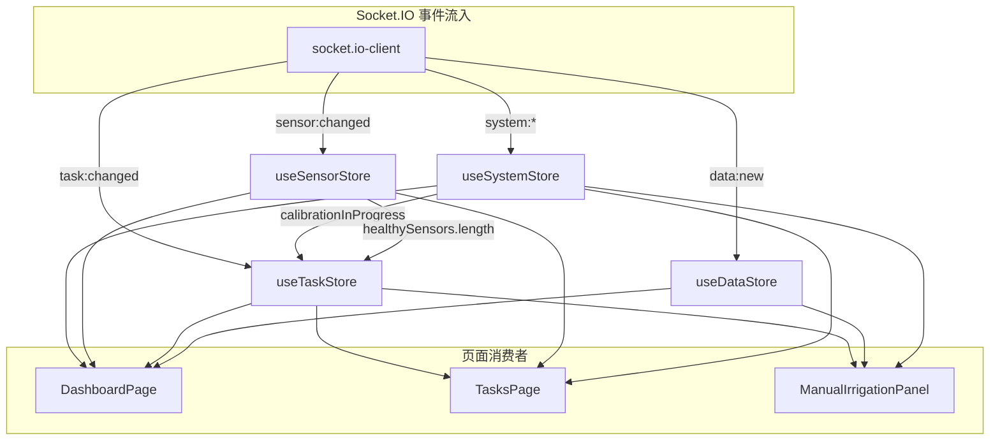
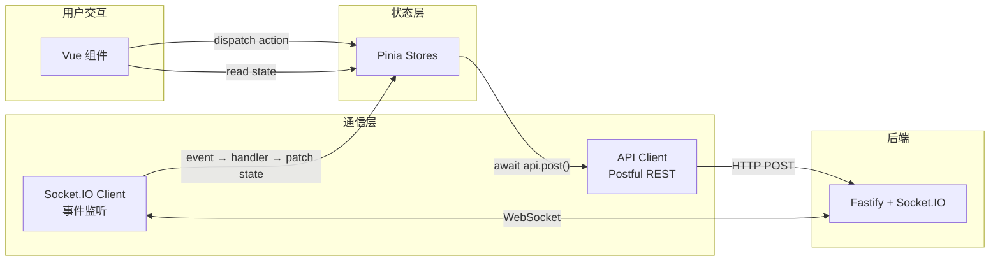
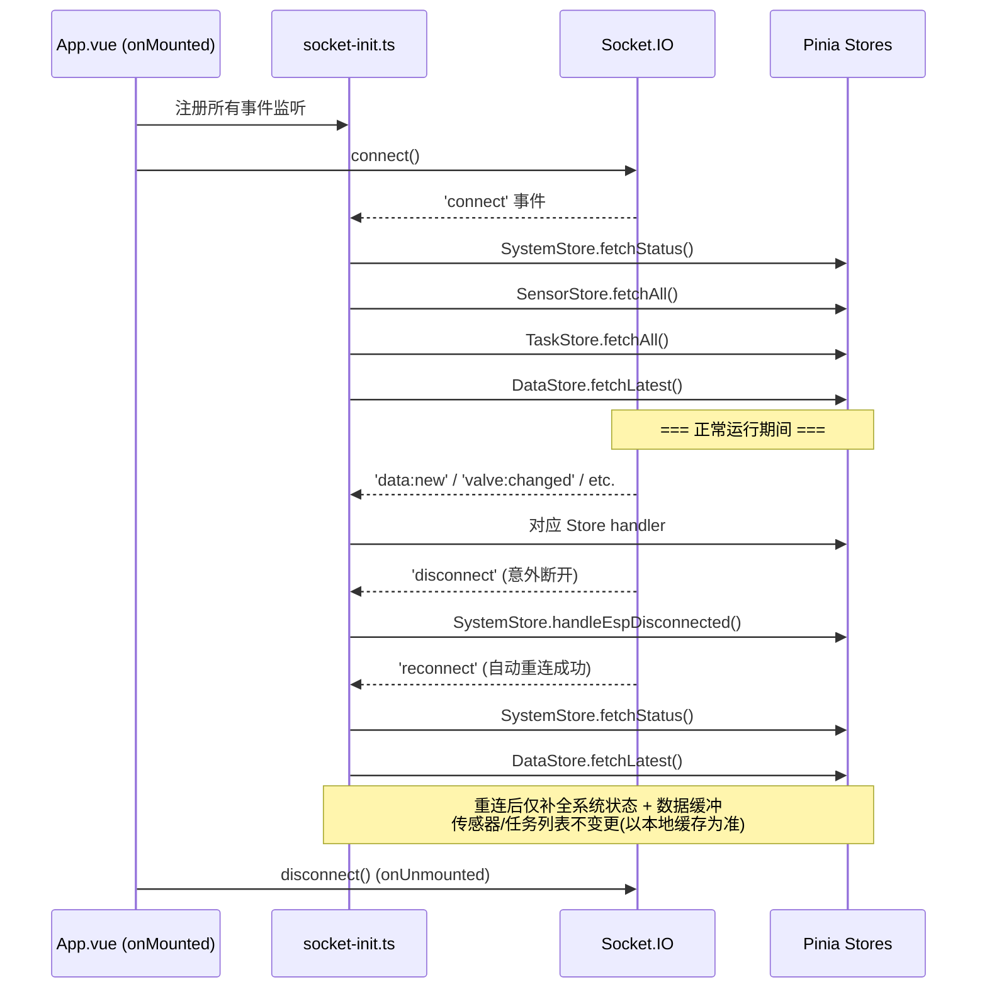
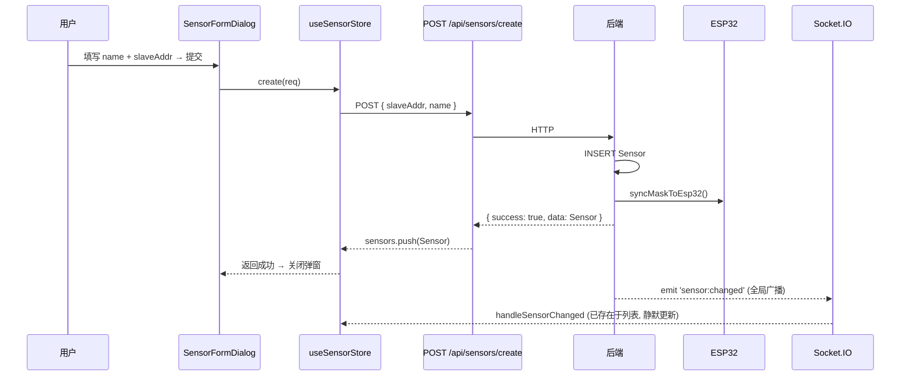
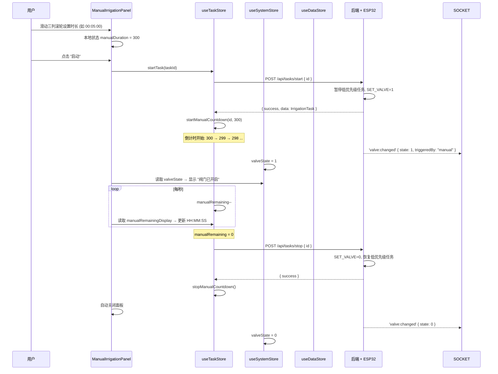
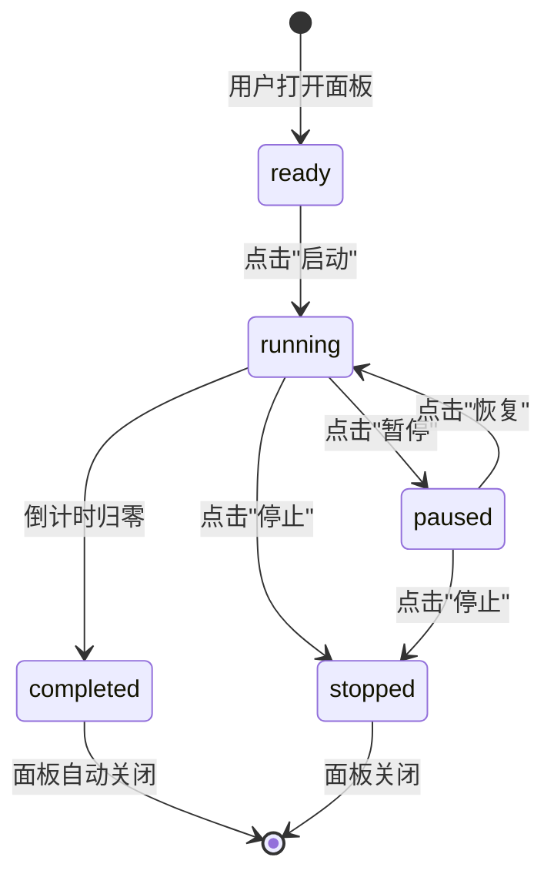

# 前端界面设计

> **文档日期**: 2026-07-28  
> **项目**: ESP32 自动灌溉系统 — Web 控制面板  
> **依赖**: `docs/architecture.md`、`docs/api-design.md`、`docs/backend-design.md`  
> **UI 框架**: Element Plus + ECharts

---

## 目录

1. [设计目标与原则](#1-设计目标与原则)
2. [路由与布局设计](#2-路由与布局设计)
3. [组件树](#3-组件树)
4. [状态管理](#4-状态管理)
5. [数据流设计](#5-数据流设计)
6. [页面详细设计](#6-页面详细设计)
7. [UI/UX 规范](#7-uiux-规范)
8. [决策日志](#8-决策日志)

---

## 1. 设计目标与原则

### 1.1 核心目标

| 目标             | 说明                                                                                                 |
| ---------------- | ---------------------------------------------------------------------------------------------------- |
| **混合端体验**   | 管理类操作（传感器配置、校准、历史数据查看）以 PC 端为基准设计；实时监控与任务操作以移动端为基准设计 |
| **状态处处可见** | 系统连接状态、阀门状态、含水量数据在关键页面中持续可见，无需频繁跳转                                 |
| **操作即反馈**   | 所有写操作通过 Socket.IO 获得即时确认推送，不仅依赖 HTTP 响应                                        |
| **优雅降级**     | 传感器数量为 0、ESP32 未连接等边界状态下前端正常运行，用占位组件替代不可用模块                       |

### 1.2 设计原则

| 原则               | 具体表现                                                                                                                                                                         |
| ------------------ | -------------------------------------------------------------------------------------------------------------------------------------------------------------------------------- |
| **扁平化优先**     | 无渐变、无阴影堆叠、无拟物纹理，仅用色块和细线分隔                                                                                                                               |
| **灰度为主**       | 亮色主题白底黑字，暗色主题黑底白字。彩色仅限语义色（成功/警告/危险/信息）                                                                                                        |
| **双主题自由切换** | 亮色/暗色各一套完整变量，支持运行时切换并持久化用户偏好                                                                                                                          |
| **SCSS 管理样式**  | 所有样式使用 `.scss` 文件，通过变量、混入、嵌套组织；CSS 自定义属性用于运行时主题切换，SCSS 变量和混入用于编译期样式复用                                                         |
| **组件按需导入**   | Element Plus 组件**不全局注册**（如 `app.use(ElementPlus)` 会丢失所有 TypeScript 类型检查），每个组件在 `<script setup>` 中显式 `import` 以获得完整的 TS 泛型提示和 IDE 智能感知 |
| **大触控区域**     | 移动端所有可交互元素最小 44×44px（符合 iOS HIG / Material Design 建议）                                                                                                          |
| **数据先行**       | 实时数据图表和含水量读数是页面主角，装饰性元素最小化                                                                                                                             |

### 1.3 边界状态设计原则

系统在以下边界状态下必须保持可用：

| 边界状态           | 前端行为                                                                                     |
| ------------------ | -------------------------------------------------------------------------------------------- |
| **无传感器**       | 仪表盘的传感器健康网格替换为 "暂无传感器，请先添加" 引导卡片；湿度任务创建被禁用并提示原因   |
| **ESP32 未连接**   | 顶栏连接指示灯变红；所有需要硬件交互的操作（手动灌溉、阀门控制）提示并禁用；历史数据仍可查看 |
| **无历史数据**     | ECharts 图表区域显示空状态插画 + "暂无数据"                                                  |
| **WebSocket 断开** | 顶栏指示 + 30s 后若未恢复则贴顶横幅提示；图表区域用半透明遮罩标记数据可能滞后                |
| **校准进行中**     | 任务管理页全局提示横幅 + 创建/启动任务按钮禁用 + 原因说明                                    |
| **全传感器故障**   | 湿度任务自动暂停提示；仪表盘含水量显示 "N/A"；定时任务不受影响                               |

---

## 2. 路由与布局设计

### 2.1 路由表

```typescript
const routes = [
    {
        path: '/',
        redirect: '/dashboard',
    },
    {
        path: '/dashboard',
        name: 'dashboard',
        component: () => import('@/pages/DashboardPage.vue'),
        meta: { title: '仪表盘', icon: 'Odometer' },
    },
    {
        path: '/sensors',
        name: 'sensors',
        component: () => import('@/pages/SensorsPage.vue'),
        meta: { title: '传感器', icon: 'Connection' },
    },
    {
        path: '/sensors/:id/calibration',
        name: 'sensor-calibration',
        component: () => import('@/pages/CalibrationPage.vue'),
        meta: { title: '校准', hidden: true },
    },
    {
        path: '/tasks',
        name: 'tasks',
        component: () => import('@/pages/TasksPage.vue'),
        meta: { title: '任务', icon: 'Timer' },
    },
    {
        path: '/history',
        name: 'history',
        component: () => import('@/pages/HistoryPage.vue'),
        meta: { title: '历史', icon: 'TrendCharts' },
    },
];
```

| 路由                       | 页面       | 端侧重        | 说明                                           |
| -------------------------- | ---------- | ------------- | ---------------------------------------------- |
| `/dashboard`               | 仪表盘     | 📱 移动端优先 | 系统状态卡片 + 实时含水量图表 + 传感器健康概览 |
| `/sensors`                 | 传感器管理 | 🖥️ PC 优先    | ElTable 列表 + 添加/编辑/删除 + 故障标记       |
| `/sensors/:id/calibration` | 校准工作流 | 🖥️ PC 优先    | 步骤引导式校准流程（不在顶栏 Tab 中显示）      |
| `/tasks`                   | 任务管理   | 📱 移动端优先 | 三类任务卡片 + 手动灌溉全屏面板                |
| `/history`                 | 历史数据   | 🖥️ PC 优先    | ECharts 时序图 + 时间范围选择 + 分辨率切换     |

### 2.2 全局布局结构

所有页面共享同一布局框架：

```
┌──────────────────────────────────────────────┐
│  TopBar                                       │
│  ┌────┬─────┬──────┬──────┬─────┬──────────┐ │
│  │Logo│仪表盘│传感器│ 任务 │历史 │ 🌙 切换  │ │
│  └────┴─────┴──────┴──────┴─────┴──────────┘ │
│  ─────────────────────────────────────────── │
│  StatusBar (条件渲染)                         │
│  ├─ ⚠ 校准进行中 横幅                         │
│  ├─ ⚠ ESP32 断开 横幅                         │
│  └─ ⚠ WebSocket 断开 横幅                     │
├──────────────────────────────────────────────┤
│                                              │
│              <router-view />                 │
│                                              │
│                                              │
└──────────────────────────────────────────────┘
```

**TopBar 组件规格**：

| 元素       | 说明                                                          |
| ---------- | ------------------------------------------------------------- |
| Logo       | 文字 "Water" 或简易图标，点击回仪表盘                         |
| Tab 导航   | `el-tabs` 与路由绑定，当前页高亮（Element Plus 下划线指示器） |
| 主题切换   | `el-switch` 或图标按钮，亮色🌙 / 暗色☀️                       |
| 连接指示灯 | 右侧固定，绿点/红点表示 ESP32 连接状态                        |

**StatusBar 组件**：

条件渲染的全局横幅，堆叠在 TopBar 下方。优先级从高到低：

1. `EspDisconnectedBanner` — ESP32 断开，橙色背景
2. `SocketDisconnectedBanner` — WebSocket 断开，黄色背景
3. `CalibrationBanner` — 校准进行中，蓝色背景，显示校准中的传感器名称

### 2.3 响应式布局策略

| 断点    | 布局行为                                                                     |
| ------- | ---------------------------------------------------------------------------- |
| ≥ 768px | **PC 模式**：TopBar 文字 + 图标并排，内容区最大宽度 `1200px` 居中            |
| < 768px | **移动模式**：TopBar 仅显示图标（文字隐藏），内容区全宽，内边距缩减至 `16px` |

```scss
/* 关键断点变量 */
:root {
    --bp-mobile: 768px;
    --content-max-width: 1200px;
    --padding-pc: 24px;
    --padding-mobile: 16px;
}
```

### 2.4 手动灌溉面板布局

手动灌溉不以独立路由存在，而是在 `/tasks` 页面内以**全屏覆盖面板**形式呈现：

- 点击手动任务卡片的 "启动" 按钮 → 面板从底部滑入（移动端）或居中弹出（PC 端）
- 面板覆盖 TopBar 之下的全部内容区
- 面板内包含自己的小型导航栏（返回按钮 + 标题 "手动灌溉"）
- 该面板内不显示 StatusBar 横幅（避免干扰倒计时视觉）

---

## 3. 组件树

### 3.1 顶层结构

```
App.vue
├── AppLayout.vue                   ← 全局布局壳
│   ├── TopBar.vue                  ← 顶栏导航 + 主题切换 + 连接指示
│   ├── StatusBar.vue               ← 条件横幅区
│   │   ├── EspDisconnectedBanner.vue
│   │   ├── SocketDisconnectedBanner.vue
│   │   └── CalibrationBanner.vue
│   └── <router-view />            ← 页面出口
│       ├── DashboardPage.vue
│       ├── SensorsPage.vue
│       ├── CalibrationPage.vue
│       ├── TasksPage.vue
│       │   └── ManualIrrigationPanel.vue  ← 全屏覆盖
│       └── HistoryPage.vue
```

### 3.2 页面级组件展开

#### DashboardPage.vue

```
DashboardPage.vue
├── SystemStatusCards.vue           ← 4 个状态卡片横排（PC）/ 2×2 网格（移动）
│   ├── StatusCard.vue ×4           ← 单个卡片（阀门状态、ESP32、活跃任务、传感器健康数）
├── RealtimeMoistureChart.vue       ← ECharts 实时折线图（每秒追加数据点）
├── SensorHealthGrid.vue            ← 传感器健康网格（PC: 4列, 移动: 2列）
│   └── SensorHealthChip.vue ×N     ← 单个传感器状态条（名称 + 含水量 + 状态灯）
├── QuickActionBar.vue              ← 快捷操作栏（仅移动端底部固定）
│   └── QuickIrrigationButton.vue   ←   跳转手动灌溉大按钮
└── EmptyState.vue ×2               ← 无传感器 / 无数据时的占位
```

#### SensorsPage.vue

```
SensorsPage.vue
├── SensorTable.vue                 ← ElTable 传感器列表
│   ├── columns: 名称 / 地址 / 故障 / 校准状态 / 操作
│   └── 操作列: 编辑 / 标记故障 / 校准 / 删除
├── SensorFormDialog.vue            ← 添加/编辑对话框（el-dialog）
└── EmptyState.vue                  ← 无传感器时的引导
```

#### CalibrationPage.vue

```
CalibrationPage.vue
├── CalibrationStepper.vue          ← ElSteps 步骤条（采集数据 → 查看数据 → 计算 → 确认）
├── CalibrationDataCollect.vue      ← 步骤1: 输入实际含水量 + 自动读取脉冲
├── CalibrationDataTable.vue        ← 步骤2: ElTable 已提交数据点列表
├── CalibrationResult.vue           ← 步骤3: 计算结果展示（公式 + R²）
└── CalibrationConfirm.vue          ← 步骤4: 确认应用 + 退出校准
```

#### TasksPage.vue

```
TasksPage.vue
├── TaskTypeTabs.vue                ← 三个 Tab: 手动 / 湿度 / 定时
├── TaskCardList.vue                ← 当前 Tab 下的任务卡片列表
│   └── TaskCard.vue ×N             ← 单任务卡片（类型图标 + 配置摘要 + 状态按钮）
├── TaskFormDialog.vue              ← 创建/编辑任务对话框
└── ManualIrrigationPanel.vue       ← 全屏覆盖面板（手动任务启动时）
    ├── ManualIrrigationHeader.vue  ←   返回按钮 + 标题
    ├── DurationScrollPicker.vue    ←   时/分/秒 三列滚轮选择器（停止状态）
    ├── CountdownDisplay.vue        ←   HH:MM:SS 剩余时间数字（运行状态）
    ├── ProgressBar.vue             ←   进度条（运行状态）
    ├── MoistureOverlay.vue         ←   实时含水量叠加层
    ├── ValveIndicator.vue          ←   阀门状态指示
    └── ManualIrrigationControls.vue←   启动 / 暂停 / 停止 大按钮
```

#### HistoryPage.vue

```
HistoryPage.vue
├── TimeRangePicker.vue             ← 时间范围选择器（el-date-picker + 快捷按钮）
├── ResolutionSwitch.vue            ← 分辨率切换（raw / second / hour）
├── HistoryChart.vue                ← ECharts 时间序列图
└── EmptyState.vue                  ← 无数据时
```

### 3.3 共享组件清单

| 组件                  | 用途                                              | 使用位置                             |
| --------------------- | ------------------------------------------------- | ------------------------------------ |
| `StatusCard`          | 单个状态指标卡片（图标 + 标题 + 值 + 状态色）     | DashboardPage                        |
| `EmptyState`          | 空状态占位（插画/图标 + 提示文字 + 可选操作按钮） | 多个页面                             |
| `ValveIndicator`      | 阀门状态可视化（圆形脉冲动画 + 文字）             | DashboardPage, ManualIrrigationPanel |
| `MoistureBadge`       | 含水量数值徽章（带颜色梯度）                      | SensorHealthGrid, MoistureOverlay    |
| `ConnectionDot`       | 连接状态圆点（绿色脉冲 / 红色常亮 / 黄色闪烁）    | TopBar                               |
| `ConfirmDeleteDialog` | 删除确认对话框（统一风格）                        | 多个页面                             |
| `LoadingOverlay`      | 加载遮罩（透明 + 居中 spinner）                   | 多个页面                             |

### 3.4 空状态处理矩阵

| 场景         | 组件                        | 展示内容                                                           |
| ------------ | --------------------------- | ------------------------------------------------------------------ |
| 无传感器     | `EmptyState`                | 图标: `Connection` + 文案: "暂无传感器" + 按钮: "添加第一个传感器" |
| ESP32 未连接 | `StatusCard` + `EmptyState` | 红色连接卡片 + 实时图表区域灰显 "设备未连接"                       |
| 无历史数据   | `EmptyState`                | 图标: `TrendCharts` + 文案: "暂无历史数据，采集开始后将在此显示"   |
| 无活跃任务   | `EmptyState`                | 图标: `Timer` + 文案: "暂无任务，创建一个灌溉任务吧"               |
| 全传感器故障 | `EmptyState`                | 仪表盘含水量显示 "N/A"，湿度任务显示 "所有传感器故障" 提示         |
| 校准无数据点 | `EmptyState`                | 数据点表格显示 "尚未提交数据点"                                    |

---

## 4. 状态管理

采用 Pinia 4 Composition API 风格，按领域拆分为 4 个 Store。Store 之间通过组合引用（而非 import 循环依赖）协作。

### 4.1 Store 总览

```
stores/
├── system.ts       ← useSystemStore    — ESP32 连接、阀门、校准全局状态
├── sensors.ts      ← useSensorStore    — 传感器 CRUD、校准数据
├── tasks.ts        ← useTaskStore      — 灌溉任务 CRUD、手动灌溉计时
├── data.ts         ← useDataStore      — 实时数据缓冲、历史查询
└── theme.ts        ← useThemeStore     — 亮色/暗色主题切换（持久化）
```

| Store            | 职责                                                                                         | 数据来源                                                                      | 消费者                                                  |
| ---------------- | -------------------------------------------------------------------------------------------- | ----------------------------------------------------------------------------- | ------------------------------------------------------- |
| `useSystemStore` | ESP32 连接状态、阀门状态、校准模式标志、系统摘要                                             | REST `system/status` + Socket.IO `system:*`, `valve:changed`, `calibration:*` | TopBar, StatusBar, DashboardPage, ManualIrrigationPanel |
| `useSensorStore` | 传感器列表、单个传感器详情、校准状态                                                         | REST `sensors/*` + Socket.IO `sensor:changed`                                 | SensorsPage, CalibrationPage, DashboardPage             |
| `useTaskStore`   | 任务列表、任务状态机、手动灌溉倒计时                                                         | REST `tasks/*` + Socket.IO `task:changed`                                     | TasksPage, ManualIrrigationPanel, DashboardPage         |
| `useDataStore`   | 实时数据点缓冲（最多 5 分钟）、历史查询结果                                                  | Socket.IO `data:new` + REST `data/latest` + REST `data/history`               | DashboardPage, HistoryPage, ManualIrrigationPanel       |
| `useThemeStore`  | 当前主题（`light` / `dark`），通过 `pinia-plugin-persistedstate` 自动持久化到 `localStorage` | 用户操作（TopBar 切换按钮）                                                   | App.vue (CSS 变量注入), TopBar (切换控件)               |

### 4.2 useSystemStore

```typescript
// stores/system.ts
export const useSystemStore = defineStore('system', () => {
    // ---- 状态 ----
    const espConnected = ref<boolean>(false); // ESP32 TCP 连接状态
    const espLastSeen = ref<number | null>(null); // 最近一次 ESP32 心跳时间戳
    const valveState = ref<0 | 1>(0); // 当前阀门状态
    const activeTaskCount = ref(0); // RUNNING 状态任务数
    const calibrationInProgress = ref(false); // 全局校准模式标记
    const calibratingSensorId = ref<number | null>(null); // 正在校准的传感器 ID
    const lastCollectionTime = ref<string | null>(null); // 最近采集 ISO 时间

    // ---- 计算属性 ----
    const isValveOpen = computed(() => valveState.value === 1);
    const espStatusText = computed(() => (espConnected.value ? '已连接' : '未连接'));

    // ---- 操作 ----
    async function fetchStatus() {
        const res = await api.post('/api/system/status');
        if (res.success) {
            espConnected.value = res.data.espConnected;
            valveState.value = res.data.valveState;
            activeTaskCount.value = res.data.activeTaskCount;
            calibrationInProgress.value = res.data.calibrationInProgress;
            lastCollectionTime.value = res.data.lastCollectionTime;
        }
    }

    function handleEspConnected(timestamp: number) {
        espConnected.value = true;
        espLastSeen.value = timestamp;
    }

    function handleEspDisconnected(timestamp: number) {
        espConnected.value = false;
        espLastSeen.value = timestamp;
    }

    function handleValveChanged(event: { state: 0 | 1; triggeredBy: string }) {
        valveState.value = event.state;
    }

    function handleCalibrationStarted(sensorId: number) {
        calibrationInProgress.value = true;
        calibratingSensorId.value = sensorId;
    }

    function handleCalibrationStopped() {
        calibrationInProgress.value = false;
        calibratingSensorId.value = null;
    }

    return {
        espConnected,
        espLastSeen,
        valveState,
        activeTaskCount,
        calibrationInProgress,
        calibratingSensorId,
        lastCollectionTime,
        isValveOpen,
        espStatusText,
        fetchStatus,
        handleEspConnected,
        handleEspDisconnected,
        handleValveChanged,
        handleCalibrationStarted,
        handleCalibrationStopped,
    };
});
```

**Socket.IO 绑定**（在 `main.ts` 的 Socket.IO 初始化中进行，而非 Store 内部）：

```typescript
// socket-init.ts
socket.on('system:esp_connected', (data) => {
    useSystemStore().handleEspConnected(data.timestamp);
});
socket.on('system:esp_disconnected', (data) => {
    useSystemStore().handleEspDisconnected(data.timestamp);
});
socket.on('valve:changed', (data) => {
    useSystemStore().handleValveChanged(data);
});
socket.on('calibration:started', (data) => {
    useSystemStore().handleCalibrationStarted(data.sensorId);
});
socket.on('calibration:stopped', () => {
    useSystemStore().handleCalibrationStopped();
});
```

> **设计决策**：Socket.IO 绑定逻辑放在独立的 `socket-init.ts` 模块而非 Store 内部。原因是：① Store 不持有 `socket` 实例（避免与 IO 层耦合）；② 多个 Store 共享同一 Socket 连接，集中绑定易于维护；③ 组件挂载时才 `connect()`（避免未渲染时消费无用事件）。

### 4.3 useSensorStore

```typescript
// stores/sensors.ts
export const useSensorStore = defineStore('sensors', () => {
    // ---- 状态 ----
    const sensors = ref<SensorDto[]>([]);
    const loading = ref(false);

    // ---- 计算属性 ----
    const healthySensors = computed(() => sensors.value.filter((s) => !s.faulty));
    const calibratedSensors = computed(() => sensors.value.filter((s) => s.calibrated));
    const faultySensorCount = computed(() => sensors.value.filter((s) => s.faulty).length);
    const sensorByAddr = computed(() => {
        const map = new Map<number, SensorDto>();
        sensors.value.forEach((s) => map.set(s.slaveAddr, s));
        return map;
    });

    // ---- 操作 ----
    async function fetchAll() {
        loading.value = true;
        const res = await api.post('/api/sensors/list');
        if (res.success) sensors.value = res.data;
        loading.value = false;
    }

    async function create(req: SensorCreateRequest): Promise<SensorDto | null> {
        const res = await api.post('/api/sensors/create', req);
        if (res.success) {
            sensors.value.push(res.data);
            return res.data;
        }
        return null;
    }

    async function update(req: SensorUpdateRequest): Promise<SensorDto | null> {
        const res = await api.post('/api/sensors/update', req);
        if (res.success) {
            const idx = sensors.value.findIndex((s) => s.id === req.id);
            if (idx >= 0) sensors.value[idx] = res.data;
            return res.data;
        }
        return null;
    }

    async function remove(id: number): Promise<boolean> {
        const res = await api.post('/api/sensors/delete', { id });
        if (res.success) {
            sensors.value = sensors.value.filter((s) => s.id !== id);
            return true;
        }
        return false;
    }

    function handleSensorChanged(sensor: SensorDto) {
        const idx = sensors.value.findIndex((s) => s.id === sensor.id);
        if (idx >= 0) sensors.value[idx] = sensor;
    }

    return {
        sensors,
        loading,
        healthySensors,
        calibratedSensors,
        faultySensorCount,
        sensorByAddr,
        fetchAll,
        create,
        update,
        remove,
        handleSensorChanged,
    };
});
```

**Socket.IO 绑定**：

```typescript
socket.on('sensor:changed', (data) => {
    useSensorStore().handleSensorChanged(data);
});
```

### 4.4 useTaskStore

```typescript
// stores/tasks.ts
export const useTaskStore = defineStore('tasks', () => {
    // ---- 状态 ----
    const tasks = ref<IrrigationTask[]>([]);
    const loading = ref(false);

    // ---- 手动灌溉倒计时专用状态 ----
    const manualRunning = ref(false); // 是否正在手动灌溉
    const manualTaskId = ref<number | null>(null); // 当前活跃手动任务 ID
    const manualDuration = ref(0); // 预设总时长（秒）
    const manualRemaining = ref(0); // 剩余秒数
    const manualPaused = ref(false); // 手动暂停中
    let manualTimerInterval: ReturnType<typeof setInterval> | null = null;

    // ---- 计算属性 ----
    const manualTasks = computed(() => tasks.value.filter((t) => t.type === 'manual'));
    const humidityTask = computed(() => tasks.value.find((t) => t.type === 'humidity') ?? null);
    const timedTasks = computed(() => tasks.value.filter((t) => t.type === 'timed'));
    const runningTasks = computed(() => tasks.value.filter((t) => t.state === 'running'));

    const manualRemainingDisplay = computed(() => {
        const h = Math.floor(manualRemaining.value / 3600);
        const m = Math.floor((manualRemaining.value % 3600) / 60);
        const s = manualRemaining.value % 60;
        return {
            hours: String(h).padStart(2, '0'),
            minutes: String(m).padStart(2, '0'),
            seconds: String(s).padStart(2, '0'),
        };
    });

    // ---- 操作 ----
    async function fetchAll(stateFilter?: string) {
        loading.value = true;
        const res = await api.post('/api/tasks/list', { state: stateFilter });
        if (res.success) tasks.value = res.data;
        loading.value = false;
    }

    async function create(req: TaskCreateRequest): Promise<IrrigationTask | null> {
        const res = await api.post('/api/tasks/create', req);
        if (res.success) {
            tasks.value.push(res.data);
            return res.data;
        }
        return null;
    }

    async function updateTask(id: number, config: unknown): Promise<IrrigationTask | null> {
        const res = await api.post('/api/tasks/update', { id, config });
        if (res.success) {
            const idx = tasks.value.findIndex((t) => t.id === id);
            if (idx >= 0) tasks.value[idx] = res.data;
            return res.data;
        }
        return null;
    }

    async function removeTask(id: number): Promise<boolean> {
        const res = await api.post('/api/tasks/delete', { id });
        if (res.success) {
            tasks.value = tasks.value.filter((t) => t.id !== id);
            return true;
        }
        return false;
    }

    async function startTask(id: number): Promise<boolean> {
        const res = await api.post('/api/tasks/start', { id });
        if (res.success) {
            const task = tasks.value.find((t) => t.id === id);
            if (task && task.type === 'manual') {
                startManualCountdown(id, task.config.durationSeconds);
            }
            return true;
        }
        return false;
    }

    async function stopTask(id: number): Promise<boolean> {
        const res = await api.post('/api/tasks/stop', { id });
        if (res.success) {
            stopManualCountdown();
            return true;
        }
        return false;
    }

    async function pauseTask(id: number): Promise<boolean> {
        const res = await api.post('/api/tasks/pause', { id });
        if (res.success) {
            if (id === manualTaskId.value) {
                manualPaused.value = true;
                clearManualTimer();
            }
            return true;
        }
        return false;
    }

    async function resumeTask(id: number): Promise<boolean> {
        const res = await api.post('/api/tasks/resume', { id });
        if (res.success) {
            if (id === manualTaskId.value) {
                manualPaused.value = false;
                startManualTimer();
            }
            return true;
        }
        return false;
    }

    async function cancelTask(id: number): Promise<boolean> {
        const res = await api.post('/api/tasks/cancel', { id });
        if (res.success) {
            if (id === manualTaskId.value) stopManualCountdown();
            return true;
        }
        return false;
    }

    // ---- 手动灌溉计时器内部逻辑 ----
    function startManualCountdown(taskId: number, durationSeconds: number) {
        manualRunning.value = true;
        manualTaskId.value = taskId;
        manualDuration.value = durationSeconds;
        manualRemaining.value = durationSeconds;
        manualPaused.value = false;
        startManualTimer();
    }

    function startManualTimer() {
        clearManualTimer();
        manualTimerInterval = setInterval(() => {
            if (manualRemaining.value <= 0) {
                stopManualCountdown();
                return;
            }
            manualRemaining.value--;
        }, 1000);
    }

    function clearManualTimer() {
        if (manualTimerInterval) {
            clearInterval(manualTimerInterval);
            manualTimerInterval = null;
        }
    }

    function stopManualCountdown() {
        clearManualTimer();
        manualRunning.value = false;
        manualTaskId.value = null;
        manualDuration.value = 0;
        manualRemaining.value = 0;
        manualPaused.value = false;
    }

    function handleTaskChanged(task: IrrigationTask) {
        const idx = tasks.value.findIndex((t) => t.id === task.id);
        if (idx >= 0) {
            tasks.value[idx] = task;
        } else {
            tasks.value.push(task);
        }
    }

    return {
        tasks,
        loading,
        manualTasks,
        humidityTask,
        timedTasks,
        runningTasks,
        manualRunning,
        manualTaskId,
        manualDuration,
        manualRemaining,
        manualPaused,
        manualRemainingDisplay,
        fetchAll,
        create,
        updateTask,
        removeTask,
        startTask,
        stopTask,
        pauseTask,
        resumeTask,
        cancelTask,
        handleTaskChanged,
    };
});
```

**Socket.IO 绑定**：

```typescript
socket.on('task:changed', (data) => {
    useTaskStore().handleTaskChanged(data);
});
```

> **手动灌溉计时器设计决策**：倒计时在前端本地维护，而非依赖后端的持续推送。原因：① 1 秒间隔的后端推送增加 Socket.IO 压力；② 移动端浏览器 `setInterval` 在后台页面会被降频（最低 1 秒），但手动灌溉场景下用户通常在面板中停留，影响有限；③ 后端 `task:changed` 事件在任务完成/取消时推送，作为前端的"校准信号"——若前端倒计时因挂起等原因漂移，收到后端事件后重置。

### 4.5 useDataStore

```typescript
// stores/data.ts
export const useDataStore = defineStore('data', () => {
    // ---- 状态 ----
    const dataBuffer = ref<DataSnapshot[]>([]); // 最近 5 分钟实时数据缓冲
    const history = ref<DataPoint[]>([]); // 历史查询结果
    const bufferMaxSize = 300; // 5分钟 × 60秒 = 300 点上限

    // ---- 计算属性 ----
    const latestSnapshot = computed<DataSnapshot | null>(() =>
        dataBuffer.value.length > 0 ? dataBuffer.value[dataBuffer.value.length - 1] : null,
    );
    const latestMoisture = computed<number | null>(() => latestSnapshot.value?.avgMoisture ?? null);

    // ECharts 需要的格式化数据
    const chartMoistureSeries = computed(() =>
        dataBuffer.value.map((d) => [d.timestamp, d.avgMoisture] as [string, number | null]),
    );
    const chartValveSeries = computed(() =>
        dataBuffer.value.map((d) => [d.timestamp, d.valveState] as [string, 0 | 1]),
    );

    // ---- 操作 ----
    function pushSnapshot(snapshot: DataSnapshot) {
        dataBuffer.value.push(snapshot);
        // 滑动窗口：超过上限丢弃最旧
        while (dataBuffer.value.length > bufferMaxSize) {
            dataBuffer.value.shift();
        }
    }

    // 重连时批量补全（替代逐个 push，减少响应式触发次数）
    function fillBuffer(snapshots: DataSnapshot[]) {
        dataBuffer.value = snapshots.slice(-bufferMaxSize);
    }

    async function fetchLatest(minutes: number = 5) {
        const res = await api.post('/api/data/latest', { minutes });
        if (res.success) {
            fillBuffer(res.data.readings);
        }
    }

    async function fetchHistory(from: string, to: string, resolution?: string) {
        const res = await api.post('/api/data/history', { from, to, resolution });
        if (res.success) {
            history.value = res.data;
        }
    }

    return {
        dataBuffer,
        history,
        latestSnapshot,
        latestMoisture,
        chartMoistureSeries,
        chartValveSeries,
        pushSnapshot,
        fillBuffer,
        fetchLatest,
        fetchHistory,
    };
});
```

**Socket.IO 绑定**：

```typescript
socket.on('data:new', (data: DataSnapshot) => {
    useDataStore().pushSnapshot(data);
});
```

### 4.6 Store 间协作关系



**关键协作场景**：

| 场景         | 涉及 Store                  | 协作逻辑                                                                                              |
| ------------ | --------------------------- | ----------------------------------------------------------------------------------------------------- |
| 手动灌溉启动 | `TaskStore` + `SystemStore` | `TaskStore.startTask()` 后，`SystemStore.valveState` 变为 1，`ManualIrrigationPanel` 同时读取两方状态 |
| 校准阻塞任务 | `SystemStore` + `TaskStore` | `SystemStore.calibrationInProgress` → `TasksPage` 禁用创建/启动按钮                                   |
| 传感器全故障 | `SensorStore` + `TaskStore` | `SensorStore.healthySensors.length === 0` → `TasksPage` 湿度任务卡片显示 "传感器不可用"               |
| 重连数据补全 | `DataStore` + `SystemStore` | Socket.IO `connect` 事件 → `DataStore.fetchLatest()` + `SystemStore.fetchStatus()` 并行调用           |

---

## 5. 数据流设计

### 5.1 整体数据流架构



**核心原则**：

- 组件**不直接**调用 `api.post()`，全部通过 Store 的 action
- 组件**不直接**监听 `socket.on()`，事件由 `socket-init.ts` 统一分发到各 Store
- 组件仅负责渲染和用户交互事件转发

### 5.2 Postful API 封装

```typescript
// lib/api.ts
import type { ApiResponse } from 'shared';

const BASE_URL = import.meta.env.VITE_API_BASE ?? 'http://localhost:3000';

class ApiClient {
    async post<T>(path: string, body?: Record<string, unknown>): Promise<ApiResponse<T>> {
        const response = await fetch(`${BASE_URL}${path}`, {
            method: 'POST',
            headers: { 'Content-Type': 'application/json' },
            body: body ? JSON.stringify(body) : '{}',
        });
        if (!response.ok) {
            // HTTP 500 → 统一返回 INTERNAL_ERROR
            return {
                success: false,
                error: { code: 'INTERNAL_ERROR', message: '服务器内部错误' },
            };
        }
        return response.json();
    }
}

export const api = new ApiClient();
```

**特质**：

| 特性           | 实现                                                                                                              |
| -------------- | ----------------------------------------------------------------------------------------------------------------- |
| 统一 POST      | 所有端点使用 `api.post()`，方法名不暴露 HTTP method                                                               |
| HTTP 500 兜底  | 非 200 响应统一转为 `INTERNAL_ERROR`，不中断调用方                                                                |
| 错误不进 Store | API 层返回 `success: false` 后由 Store action 决定如何传播（组件通过 `try/catch` 或检查返回值），错误不会污染状态 |
| 无重试         | 局域网内网络抖动极少，不引入重试复杂度。用户看到错误后可手动重试                                                  |
| 无全局拦截器   | 不设全局 loading / toast，由各组件根据 store 的 `loading` 状态自行展示                                            |

### 5.3 Socket.IO 客户端初始化

```typescript
// lib/socket.ts
import { io, Socket } from 'socket.io-client';

const SOCKET_URL = import.meta.env.VITE_SOCKET_URL ?? 'http://localhost:3000';

export const socket: Socket = io(SOCKET_URL, {
    autoConnect: false, // 手动控制连接时机
    reconnection: true,
    reconnectionDelay: 1000, // 初始重连间隔 1s
    reconnectionDelayMax: 10000, // 最大重连间隔 10s
    reconnectionAttempts: Infinity,
});

export function connectSocket() {
    if (!socket.connected) socket.connect();
}

export function disconnectSocket() {
    if (socket.connected) socket.disconnect();
}
```

**连接生命周期**：



> **重连策略**：仅补全 `SystemStore` 和 `DataStore`（这两者状态可能因连接断开期间变化而滞后）。`SensorStore` 和 `TaskStore` 的本地缓存视为"连接断开期间的真相"——如有后端侧变更，`sensor:changed` 和 `task:changed` 事件会在重连后自然推送。

### 5.4 典型用户操作数据流

#### 场景 A：用户添加传感器



#### 场景 B：手动灌溉完整流程



### 5.5 双主题数据流

主题状态纳入 Pinia Store，通过 `pinia-plugin-persistedstate` 自动持久化到 `localStorage`，避免手动操作 DOM 和 Storage。

**Store 定义**：

```typescript
// stores/theme.ts
import { defineStore } from 'pinia';

export type Theme = 'light' | 'dark';

export const useThemeStore = defineStore(
    'theme',
    () => {
        // 默认跟随系统偏好
        const current = ref<Theme>(window.matchMedia('(prefers-color-scheme: dark)').matches ? 'dark' : 'light');

        const isDark = computed(() => current.value === 'dark');

        function setTheme(theme: Theme) {
            current.value = theme;
            applyDomTheme(theme);
        }

        function toggle() {
            setTheme(current.value === 'light' ? 'dark' : 'light');
        }

        // 副作用：同步 data-theme 属性到 <html>
        function applyDomTheme(theme: Theme) {
            document.documentElement.setAttribute('data-theme', theme);
        }

        // 初始化时立即应用一次（Store 实例化时机早于 App.vue onMounted）
        applyDomTheme(current.value);

        return { current, isDark, setTheme, toggle };
    },
    {
        // pinia-plugin-persistedstate 配置
        persist: {
            key: 'water-theme',
            storage: localStorage,
            pick: ['current'], // 仅持久化 current
        },
    },
);
```

**插件注册**（`main.ts`）：

```typescript
import { createPinia } from 'pinia';
import piniaPluginPersistedstate from 'pinia-plugin-persistedstate';

const pinia = createPinia();
pinia.use(piniaPluginPersistedstate);
app.use(pinia);
```

**消费方式**：

- `App.vue`：无需在 `onMounted` 中额外初始化——`useThemeStore` 首次实例化时即从 `localStorage` 恢复值并应用到 DOM
- `TopBar.vue`：`<el-switch :model-value="theme.isDark" @change="theme.toggle()" />`
- Element Plus 主题联动：通过 `data-theme="dark"` 属性 + CSS 变量覆盖实现组件库暗色适配（详见 §7.2）。`@media (prefers-color-scheme: dark)` 作为**无 localStorage 首次访问时的 fallback**

**数据流**：

```mermaid
graph LR
    USER[用户点击主题切换] --> TOGGLE[themeStore.toggle]
    TOGGLE --> STATE[current.value 变更]
    STATE --> DOM[applyDomTheme<br/>html[data-theme] 更新]
    STATE --> PERSIST[persistedstate 插件<br/>自动写入 localStorage]
    DOM --> CSS[CSS 变量切换<br/>Element Plus + 自定义样式]
```

---

## 6. 页面详细设计

### 6.1 仪表盘（DashboardPage）

#### 6.1.1 定位与布局

仪表盘是用户打开系统后看到的首屏。以**移动端竖屏**为基准设计，PC 端通过列数扩展适配。

**移动端布局**（< 768px，单列）：

```
┌──────────────────────┐
│    SystemStatusCards │  ← 2×2 网格
│  ┌──────┬──────┐     │
│  │ 阀门 │ ESP32│     │
│  ├──────┼──────┤     │
│  │ 任务 │ 传感器│    │
│  └──────┴──────┘     │
│──────────────────────│
│                      │
│  RealtimeMoisture    │  ← ECharts 折线图
│  Chart               │     高度 200px
│                      │
│──────────────────────│
│  SensorHealthGrid    │  ← 2 列网格
│  ┌────┬────┐         │
│  │ S1 │ S2 │         │
│  ├────┼────┤         │
│  │ S3 │ S4 │         │
│  └────┴────┘         │
│──────────────────────│
│  QuickActionBar      │  ← 底部固定
│  [ ⏱️ 手动灌溉 ]      │
└──────────────────────┘
```

**PC 端布局**（≥ 768px，双列）：

```
┌─────────────────────────────────────────┐
│  SystemStatusCards (4 列横排)           │
│  ┌──────┬──────┬──────┬──────┐          │
│  │ 阀门 │ ESP32│ 任务 │ 传感器│         │
│  └──────┴──────┴──────┴──────┘          │
│─────────────────────────────────────────│
│  ┌─────────────────┬─────────────────┐  │
│  │ RealtimeChart   │ SensorHealth    │  │
│  │ (高度 320px)    │ Grid (4列)      │  │
│  │                 │                 │  │
│  └─────────────────┴─────────────────┘  │
└─────────────────────────────────────────┘
```

#### 6.1.2 SystemStatusCards

四个 `StatusCard` 组件，每个包含：

| 卡片       | 图标             | 标题   | 值（正常状态）         | 值（边界状态）       |
| ---------- | ---------------- | ------ | ---------------------- | -------------------- |
| 阀门状态   | `el-icon` 水滴   | 阀门   | "已关闭" / "灌溉中"    | "未知"（ESP32 断开） |
| ESP32 连接 | `el-icon` 连接   | 设备   | "已连接" / "已断开"    | —                    |
| 活跃任务   | `el-icon` 任务   | 任务   | `activeTaskCount` 数字 | "—"                  |
| 传感器健康 | `el-icon` 传感器 | 传感器 | `healthyCount / total` | "0 / 0"（无传感器）  |

**交互**：阀门状态卡片为**只读展示**。前端不提供任何直接开关阀门的能力——所有灌溉操作（包括手动）必须通过创建/启动任务完成。这确保每次阀门开启都有对应的自动停止机制（任务到期或 ESP32 60s 看门狗）。

**视觉规范**：

- 背景：`--card-bg`（亮色 `#fff`，暗色 `#1a1a1a`）
- 边框：`1px solid --border-color`（亮色 `#e5e5e5`，暗色 `#333`）
- 圆角：`8px`
- 状态指示灯（`ConnectionDot`）：绿 `#52c41a` / 红 `#ff4d4f` / 黄 `#faad14`

#### 6.1.3 RealtimeMoistureChart

基于 ECharts 的实时含水量折线图。

**数据源**：`useDataStore.chartMoistureSeries`（每秒追加 1 个点，上限 300 点 ≈ 5 分钟）

**图表配置**：

| 配置项 | 值                                                       |
| ------ | -------------------------------------------------------- |
| 类型   | `line` + `areaStyle` 半透明填充                          |
| X 轴   | 时间轴，格式 `HH:mm:ss`，支持 `dataZoom` 拖拽回看        |
| Y 轴   | 含水量百分比 `0% ~ 100%`，动态范围（根据实际数据自适应） |
| 线色   | `--chart-line`（语义色：`#1677ff`）                      |
| 填充色 | 线色的 15% 透明度                                        |
| 动画   | `animation: false`（实时追加数据时禁用动画避免抖动）     |
| 空状态 | `graphic` 居中文字 "暂无数据" + 图表灰色半透明遮罩       |

**边界状态处理**：

| 场景                                           | 图表行为                                             |
| ---------------------------------------------- | ---------------------------------------------------- |
| 数据缓冲为空且 ESP32 连接                      | 图表为空，Y 轴保持刻度，显示 "等待采集数据..."       |
| 数据缓冲为空且 ESP32 断开                      | 图表灰显 + "设备未连接"                              |
| `avgMoisture` 为 `null`（全传感器故障/未校准） | 该数据点的 marker 空心（不连线），图表继续但出现断点 |
| 首次加载                                       | 调用 `DataStore.fetchLatest()` 补全最近 5 分钟数据   |

**Tooltip**：悬停/长按显示 `时间 + 含水量 + 阀门状态`。

#### 6.1.4 SensorHealthGrid

按传感器列表渲染 `SensorHealthChip` 网格。无传感器时渲染 `EmptyState` 引导。

**`SensorHealthChip` 组件**：

- 显示传感器 `name`
- 显示最新含水量（`MoistureBadge`）或 "未校准" / "故障"
- 状态灯：绿色 = 健康已校准，黄色 = 健康未校准，红色 = 故障
- 点击跳转到 `/sensors`（PC）/ 弹出操作菜单（移动端）

#### 6.1.5 QuickActionBar

仅移动端显示，固定在视口底部：

```
┌──────────────────────────────┐
│       [ ⏱️ 手动灌溉 ]         │
└──────────────────────────────┘
```

- 高度 `56px`，不遮挡页面内容（`padding-bottom` 预留空间）
- 整栏仅一个主按钮，`router.push('/tasks')` 并自动打开手动灌溉面板（通过路由 query `?action=manual`）
- ESP32 断开时按钮 `disabled` + 半透明

> **不存在"开关阀门"按钮**。前端永远不直接操作阀门。即使是最紧急的手动需求，也必须创建一个手动任务并启动——任务自带 `durationSeconds`，到期后后端自动关阀。这是系统的核心安全约束。

---

### 6.2 传感器管理（SensorsPage）

#### 6.2.1 布局

PC 优先的单栏列表页：

```
┌──────────────────────────────────────────┐
│  [ + 添加传感器 ]                        │
│──────────────────────────────────────────│
│  SensorTable (ElTable)                   │
│  ┌──────────────────────────────────────┐│
│  │ 名称 │ 地址 │ 故障 │ 校准 │ 操作    ││
│  ├──────────────────────────────────────┤│
│  │ 1号盆│  #0  │ 正常 │ 已校准│ 编辑.. ││
│  │ 2号盆│  #1  │ 故障 │ 未校准│ 编辑.. ││
│  └──────────────────────────────────────┘│
└──────────────────────────────────────────┘
```

#### 6.2.2 SensorTable 列定义

| 列   | 宽度  | 渲染                                              |
| ---- | ----- | ------------------------------------------------- |
| 名称 | auto  | 普通文本                                          |
| 地址 | 80px  | `#N` 格式 (N = slaveAddr)                         |
| 故障 | 100px | `el-switch` 开关，变更后触发 `update({ faulty })` |
| 校准 | 120px | "已校准 ✅" / "未校准" + 进入校准按钮             |
| 操作 | 160px | `编辑` `删除` 按钮组                              |

**行交互**：

- 点击行跳转到 `/sensors/:id/calibration`（如果未校准）或展开详情面板
- 故障开关需二次确认（`ConfirmDeleteDialog` 风格一致），因切换会触发 ESP32 屏蔽同步

#### 6.2.3 SensorFormDialog

添加/编辑共用的 `el-dialog`：

```
┌─ 添加传感器 ──────────────────┐
│                                │
│  名称: [  1号花盆  ]           │
│  地址: [  ▼ 0  ]              │
│         (0~15, 已占用项灰显)   │
│                                │
│         [ 取消 ]  [ 确定 ]     │
└────────────────────────────────┘
```

**地址选择器**：`el-select`，选项 0~15，已占用的 `slaveAddr` 标记 `disabled` + 后缀 "(已占用-传感器名)"。

**验证**：

- 名称非空 + 去空白后长度 > 0
- 地址未被占用

**编辑模式**：地址字段禁用（不允许修改 `slaveAddr`）。

#### 6.2.4 空状态

无传感器时，`SensorTable` 替换为 `EmptyState`：

```
        📡
   暂无传感器
  添加您的第一个传感器来开始监测
    [ + 添加传感器 ]
```

---

### 6.3 校准工作流（CalibrationPage）

#### 6.3.1 整体结构

采用 `el-steps` 水平步骤条引导，4 个步骤：

```
步骤 1          步骤 2          步骤 3          步骤 4
采集数据    →   查看数据    →   计算拟合    →   确认结果
```

- 步骤条固定在页面顶部（PC: 居中, 移动: 水平可滚动）
- 当前步骤高亮，已完成步骤可点击回退
- 底部统一操作栏：`上一步` / `下一步` / `退出校准`

#### 6.3.2 步骤 1：采集数据

```
┌─────────────────────────────────────────┐
│  正在校准: 1号花盆 (地址 #0)             │
│─────────────────────────────────────────│
│                                         │
│  当前脉冲计数:     12,345               │
│  (自动读取最近采集数据，每秒刷新)        │
│                                         │
│  实际含水量 (%):   [   25    ]          │
│  (输入烘干称重法测量的含水量)            │
│                                         │
│         [ 提交此数据点 ]                │
│─────────────────────────────────────────│
│  已提交数据点:  3 个                    │
│  最新: 脉冲 12345 → 含水量 25%          │
│        (1 分钟前)                      │
└─────────────────────────────────────────┘
```

**设计要点**：

- 脉冲计数 `pulseCount` 由 `useDataStore.latestSnapshot` 对应传感器的最新值自动填充，展示为只读数字
- 当 `latestSnapshot` 中该传感器无数据或 ESP32 断开时，"当前脉冲计数"显示 "暂无数据 — 请等待采集"
- 提交按钮调用 `POST /api/sensors/calibration/submit-data`
- 提交后表单清空但步骤不推进（用户可继续在同一步骤提交多个点）

#### 6.3.3 步骤 2：查看数据

```
┌─────────────────────────────────────────┐
│  CalibrationDataTable                   │
│  ┌─────────────────────────────────────┐│
│  │ # │ 脉冲计数 │ 实际含水量 │ 时间   ││
│  ├─────────────────────────────────────┤│
│  │ 1 │ 10,200   │ 15%        │ 14:02  ││
│  │ 2 │ 11,800   │ 22%        │ 14:05  ││
│  │ 3 │ 12,345   │ 25%        │ 14:08  ││
│  └─────────────────────────────────────┘│
│                                         │
│  数据点: 3  (至少需要 2 个)             │
│                                         │
│  散点图预览 (ECharts scatter)           │
│  Y: 实际含水量   X: 脉冲计数            │
│                                         │
│         [ 下一步: 计算拟合 ]            │
└─────────────────────────────────────────┘
```

- 散点图：ECharts `scatter`，帮助用户直观判断数据点分布
- 数据点 < 2 时"下一步"按钮禁用，提示"至少需要 2 个数据点"
- 点击行可删除该数据点

#### 6.3.4 步骤 3：计算拟合

点击"计算"按钮 → 调用 `POST /api/sensors/calibration/calculate`。

**结果展示**：

```
┌─────────────────────────────────────────┐
│  拟合结果                               │
│─────────────────────────────────────────│
│                                         │
│  公式: 含水量 = 0.0032 × 脉冲 - 10.5   │
│                                         │
│  R² = 0.978                            │
│  数据点: 5                              │
│                                         │
│  拟合曲线图 (ECharts)                   │
│  散点 + 回归线叠加                      │
│                                         │
│         [ 计算 ]  [ 下一步 ]           │
└─────────────────────────────────────────┘
```

- "计算"按钮首次进入步骤 3 时立即可用
- 用户可重复点击"计算"（如继续回到步骤 1 添加点后再次计算）
- R² < 0.8 时显示警告："拟合度偏低，建议添加更多数据点或检查测量准确性"
- 点击"下一步"后才真正将结果写入 `Sensor`

#### 6.3.5 步骤 4：确认结果

```
┌─────────────────────────────────────────┐
│  确认校准结果                           │
│─────────────────────────────────────────│
│                                         │
│  传感器:   1号花盆 (#0)                │
│  拟合公式: 含水量 = 0.0032×脉冲 - 10.5 │
│  R²:       0.978                       │
│                                         │
│  确认后，该传感器将启用含水量转换。     │
│  之前的数据不受影响。                   │
│                                         │
│         [ 返回修改 ]  [ 确认应用 ]     │
└─────────────────────────────────────────┘
```

- "确认应用" → 退出校准模式 + 跳转回 `/sensors`
- `sensor:changed` 事件推送后，仪表盘和任务管理自动感知校准状态变更

#### 6.3.6 退出校准

用户可在任何步骤点击"退出校准"（固定在页面右上角或底部次要按钮）：

- 调用 `POST /api/sensors/calibration/stop`
- 确认对话框："退出校准将丢弃未保存的计算结果。已提交的数据点会保留。"
- 退出后导航回 `/sensors/:id`（传感器详情）或 `/sensors`

---

### 6.4 任务管理（TasksPage）

#### 6.4.1 布局

移动端优先，采用三 Tab 切换 + 卡片列表：

```
┌──────────────────────────────────┐
│  [ 手动灌溉 ] [ 湿度任务 ] [ 定时任务 ] │  ← el-tabs
│──────────────────────────────────│
│                                  │
│  ┌────────────────────────────┐  │
│  │ 🔧 手动灌溉                  │  │  ← TaskCard
│  │ 时长: 5 分钟               │  │
│  │ 状态: 就绪                  │  │
│  │ [ 启动灌溉 ]               │  │
│  └────────────────────────────┘  │
│                                  │
│  [ + 创建手动任务 ]             │  ← 新增按钮
└──────────────────────────────────┘
```

#### 6.4.2 TaskCard 设计

每个 `TaskCard` 包含：

| 元素            | 说明                                                                                    |
| --------------- | --------------------------------------------------------------------------------------- |
| 类型图标 + 标签 | `manual` = 🔧 手动, `humidity` = 💧 湿度, `timed` = ⏰ 定时                             |
| 配置摘要        | 手动: "时长 5 分钟"；湿度: "阈值 30% → 60%"；定时: "每天 06:00-08:00 一三五"            |
| 状态徽章        | `StatusBadge`：`idle` 灰, `running` 绿脉冲, `paused` 黄, `blocked` 橙, `completed` 蓝灰 |
| 操作按钮        | 根据状态动态变化（见 6.4.4）                                                            |

**PC 端**：卡片最大宽度 `600px` 居中排列
**移动端**：卡片全宽，触控友好的 44px 最小高度按钮

#### 6.4.3 三种任务卡片的特殊渲染

**手动任务**：

```
┌──────────────────────────────────┐
│ 🔧 手动灌溉              [就绪] │
│ ──────────────────────────────── │
│ 灌溉时长:  5 分钟               │
│ 创建时间:  07-28 14:30          │
│                                 │
│ [ ✏️ 编辑 ] [ 🗑️ 删除 ] [ ▶️ 启动 ] │
└──────────────────────────────────┘
```

**湿度任务**：

```
┌──────────────────────────────────┐
│ 💧 湿度灌溉              [运行中] │
│ ──────────────────────────────── │
│ 启动: 含水量 < 30%              │
│ 停止: 含水量 > 60%              │
│ 当前含水量: 42%  ← 实时更新     │
│                                 │
│ [ ⏸️ 暂停 ] [ ❌ 取消 ]          │
└──────────────────────────────────┘
```

> 湿度任务仅允许存在一个。若已存在，创建按钮灰显 + 提示 "湿度任务已存在"。
> 所有传感器故障时，"当前含水量"显示 "N/A — 传感器全部故障"，运行中任务自动显示警告标记。

**定时任务**：

```
┌──────────────────────────────────┐
│ ⏰ 定时灌溉              [阻塞中]  │
│ ──────────────────────────────── │
│ 时间:  每天 06:00 - 08:00       │
│ 重复:  周一、周三、周五          │
│ 被湿度任务阻塞                   │
│                                 │
│ [ ✏️ 编辑 ] [ 🗑️ 删除 ]          │
└──────────────────────────────────┘
```

> 被湿度任务阻塞时显示阻塞原因文字。`blocked` 状态的任务不可手动启动。

#### 6.4.4 操作按钮状态矩阵

| 当前状态    | 可执行操作                    |
| ----------- | ----------------------------- |
| `idle`      | 编辑、删除、启动（仅 manual） |
| `running`   | 暂停、停止（仅 manual）、取消 |
| `paused`    | 恢复、取消                    |
| `blocked`   | 编辑、删除                    |
| `completed` | 删除                          |
| `cancelled` | 删除                          |

**全局禁用条件**（覆盖所有按钮）：

- 校准进行中 → 所有创建/启动按钮禁用，提示 "校准进行中，灌溉任务暂不可用"
- ESP32 断开 → 涉及阀门操作的任务（手动/湿度/定时）按钮禁用

#### 6.4.5 TaskFormDialog

创建/编辑任务共用的 `el-dialog`。

**手动任务**：

```
┌─ 创建手动灌溉任务 ──────────────┐
│                                  │
│  灌溉时长 (秒): [ 300 ]         │
│  (1 ~ 3600 秒)                  │
│                                  │
│          [ 取消 ]  [ 创建 ]     │
└──────────────────────────────────┘
```

**湿度任务**：

```
┌─ 创建湿度灌溉任务 ──────────────┐
│                                  │
│  启动阈值 (%):  [ 30 ]          │
│  含水量低于此值时自动灌溉        │
│                                  │
│  停止阈值 (%):  [ 60 ]          │
│  含水量高于此值时停止灌溉        │
│  (必须大于启动阈值)             │
│                                  │
│          [ 取消 ]  [ 创建 ]     │
└──────────────────────────────────┘
```

**定时任务**：

```
┌─ 创建定时灌溉任务 ──────────────┐
│                                  │
│  开始时间: [ 06:00 ]            │
│  结束时间: [ 08:00 ]            │
│                                  │
│  重复日:                        │
│  ☑ 周一  ☑ 周二  ☐ 周三        │
│  ☐ 周四  ☑ 周五  ☐ 周六        │
│  ☐ 周日                        │
│                                  │
│          [ 取消 ]  [ 创建 ]     │
└──────────────────────────────────┘
```

> 时间冲突校验：若创建定时任务时与已有定时任务窗口重叠 → 后端返回 `TIME_CONFLICT`，前端在对话框中显示 "与已有任务 'xxx' 的时间窗口重叠"。

#### 6.4.6 校准中阻断

当 `useSystemStore.calibrationInProgress === true` 时：

- 页面顶部渲染 `CalibrationBanner`（"传感器 '1号花盆' 正在校准，灌溉任务暂不可操作"）
- 所有创建/启动/恢复按钮置灰 + `disabled`
- 已运行的任务可暂停但不可启动

---

### 6.5 手动灌溉面板（ManualIrrigationPanel）

手动灌溉面板是整个前端交互设计的核心亮点。它从任务管理页中的手动任务卡片触发，以**全屏覆盖**形式呈现，视觉上模拟手机倒计时 App 的使用体验。

#### 6.5.1 进入与退出

**进入方式**：

| 触发来源                           | 行为                                                                                  |
| ---------------------------------- | ------------------------------------------------------------------------------------- |
| 仪表盘 QuickActionBar              | `router.push('/tasks?action=manual')` → `TasksPage onMounted` 检测 query 自动打开面板 |
| 任务管理页手动任务卡片 "启动" 按钮 | 直接 `manualPanelVisible = true`                                                      |

**退出方式**：

| 触发来源                  | 行为                                              |
| ------------------------- | ------------------------------------------------- |
| 倒计时归零                | 面板自动关闭（300ms 延迟，让用户看到 `00:00:00`） |
| 用户点击 "停止"           | 面板自动关闭                                      |
| 用户点击面板顶部 "← 返回" | 确认对话框："灌溉正在进行中，确定要返回吗？"      |

**面板生命周期**：



#### 6.5.2 面板布局

面板覆盖 TopBar 下方全部内容区，拥有独立的微型导航栏。

**停止状态（ready）**：

```
┌──────────────────────────────────┐
│ ← 返回        手动灌溉           │  ← ManualIrrigationHeader
├──────────────────────────────────┤
│                                  │
│    ┌──────┬──────┬──────┐       │
│    │  00  │  05  │  00  │       │  ← DurationScrollPicker
│    │ 时   │ 分   │ 秒   │       │     三列滚轮
│    └──────┴──────┴──────┘       │
│                                  │
│  ┌────────────────────────────┐  │
│  │ 预设: 1分钟 │ 5分钟 │ 10分钟│ │  ← 快捷预设按钮组
│  │ 15分钟 │ 30分钟 │ 自定义  │  │
│  └────────────────────────────┘  │
│                                  │
│  ┌────────────────────────────┐  │
│  │ 💧 当前含水量: 42%         │  │  ← MoistureOverlay
│  │ 🔧 阀门: 已关闭            │  │  ← ValveIndicator
│  └────────────────────────────┘  │
│                                  │
│       [  ▶️  启动灌溉  ]         │  ← 主按钮, 44px 高
│                                  │
└──────────────────────────────────┘
```

**运行状态（running / paused）**：

```
┌──────────────────────────────────┐
│ ← 返回        手动灌溉           │
├──────────────────────────────────┤
│                                  │
│        ┌──────────────────┐      │
│        │   00 : 04 : 32   │      │  ← CountdownDisplay
│        │   剩余时间        │      │     HH:MM:SS 大字
│        └──────────────────┘      │
│                                  │
│  ████████████████░░░░░░ 92%     │  ← ProgressBar (已过/剩余)
│                                  │
│  ┌────────────────────────────┐  │
│  │ 💧 当前含水量: 42%         │  │
│  │ 🔧 阀门: ● 灌溉中          │  │  ← 绿色脉冲
│  └────────────────────────────┘  │
│                                  │
│  [ ⏸️ 暂停 ]     [ ⏹️ 停止 ]    │  ← 两个按钮
│                                  │
└──────────────────────────────────┘
```

**暂停状态**：

- `CountdownDisplay` 数字停止跳动，颜色变为黄色语义色
- "暂停"按钮文案变为 "▶️ 恢复"
- `ProgressBar` 动画暂停，填充色变为黄色 `#faad14`
- `ValveIndicator` 显示 "阀门: 已关闭"（暂停时后端关闭阀门，恢复时重新打开）
- `MoistureOverlay` 含水量正常刷新（采集不中断）

#### 6.5.3 DurationScrollPicker — 三列滚轮时长选择器

**参考原型**：iOS 计时器 App 的时长选择器。

**实现方案**：基于 `el-scrollbar` 或社区 `vue3-scroll-picker` 构建三列独立滚轮：

```
     时             分             秒
  ┌────────┐   ┌────────┐   ┌────────┐
  │   00   │   │   04   │   │   30   │
  ├────────┤   ├────────┤   ├────────┤
  │   00 ✓ │   │   03   │   │   29   │
  │   01   │   │   04 ✓ │   │   30 ✓ │  ← 选中项高亮 + 放大
  │   02   │   │   05   │   │   31   │
  ├────────┤   ├────────┤   ├────────┤
  │   03   │   │   06   │   │   32   │
  └────────┘   └────────┘   └────────┘
```

**技术规格**：

| 属性         | 值                                                                     |
| ------------ | ---------------------------------------------------------------------- |
| 列数         | 3（时 / 分 / 秒）                                                      |
| 每列可选范围 | 时: 0~23, 分: 0~59, 秒: 0~59                                           |
| 可见行数     | 5 行（中间行高亮）                                                     |
| 选中行样式   | 字号放大 1.5×，上下加渐变遮罩模拟 3D 滚轮透视                          |
| 交互         | 触摸滑动 + 鼠标滚轮，带惯性衰减（`-webkit-overflow-scrolling: touch`） |
| 初始值       | 首次打开面板：`00:05:00`（5 分钟）；非首次：保持上次设置值             |

**快捷预设**：6 个按钮，点击直接将滚轮定位到对应值：

```
[ 1 分钟 ] [ 5 分钟 ] [ 10 分钟 ] [ 15 分钟 ] [ 30 分钟 ] [ 自定义 ]
```

- 前 5 个为固定预设
- "自定义"按钮：滚轮恢复最近一次手动设置值（不做定位操作）
- 选中的预设按钮高亮（`--primary-color` 背景填充）

#### 6.5.4 CountdownDisplay — HH:MM:SS 数字显示

**字体**：等宽数字字体（`font-family: 'JetBrains Mono', 'Consolas', monospace`），确保数字跳动时宽度不变。

**字号策略**：

| 剩余时间               | PC 字号               | 移动端字号            |
| ---------------------- | --------------------- | --------------------- |
| > 1 小时               | 64px                  | 42px                  |
| 1 分钟 ~ 1 小时        | 72px                  | 48px                  |
| < 1 分钟（最后 60 秒） | 80px + 颜色渐变至红色 | 52px + 颜色渐变至红色 |

**最后 60 秒效果**：

- 数字从默认色（亮色 `#000` / 暗色 `#fff`）平滑过渡到红色（`#ff4d4f`）
- 每秒整数位变化时带轻微缩放弹跳动画（`scale(1.05)` → `scale(1)`，`transition: 200ms`）
- `ProgressBar` 同步变红

**分隔符**：`:` 固定显示，无闪烁。

#### 6.5.5 ProgressBar

运行状态下，在 `CountdownDisplay` 下方显示进度条。暂停时进度条冻结在当前位置。

```
████████████████░░░░░░ 92%
```

| 属性     | 值                                                     |
| -------- | ------------------------------------------------------ |
| 高度     | 6px                                                    |
| 背景     | `--border-color`（灰色轨道）                           |
| 填充色   | 默认 `--primary-color`，最后 60 秒 → `#ff4d4f`（红色） |
| 进度计算 | `(duration - remaining) / duration × 100%`             |
| 动画     | `transition: width 1s linear`（每秒更新时平滑过渡）    |
| 暂停时   | 填充色变为黄色 `#faad14`                               |

> 进度条展示的是**已过时间**占比（非剩余），因"已灌溉时长"比"还剩多久"更直观。

#### 6.5.6 MoistureOverlay + ValveIndicator

两个只读信息叠加层，位于滚轮/倒计时区域下方、控制按钮上方：

```
┌──────────────────────────────────┐
│ 💧 当前含水量: 42%               │  ← MoistureBadge + 数值
│ 🔧 阀门: ● 灌溉中                │  ← ConnectionDot 绿色脉冲 + 文字
└──────────────────────────────────┘
```

- 数据来自 `useDataStore.latestMoisture` 和 `useSystemStore.valveState`
- 无传感器或数据不可用时：含水量显示 "N/A"，文字灰显
- 灌溉中（运行状态）：阀门指示器绿色脉冲动画
- 暂停/就绪状态：阀门指示器灰色常亮 + "已关闭"
- 刷新频率：跟随 `data:new` 推送（约每秒一次）

#### 6.5.7 控制按钮

**启动**（ready 状态）：

- 居中大按钮，宽度 `80%`（PC: `320px`），高度 `48px`
- 文案 "启动灌溉"（`el-icon` + 文字）
- 调用 `TaskStore.startTask(manualTaskId)` → 后端创建/启动手动任务 → `manualRunning = true`
- 启动前校验：
    - ESP32 必须在线（否则提示 "设备未连接，无法启动灌溉"）
    - 校准未进行（否则提示 "校准进行中"）
    - 时长 > 0（由滚轮保证）

**暂停 / 恢复**（running / paused 状态）：

- 两个等宽按钮并排
- "暂停"：`TaskStore.pauseTask(id)` → 后端暂停任务并关闭阀门，按钮变为 "▶️ 恢复"
- "恢复"：`TaskStore.resumeTask(id)` → 后端恢复任务并重新打开阀门，按钮变为 "⏸️ 暂停"

**停止**（running / paused 状态）：

- 与暂停/恢复并排
- 红色文字（`--danger-color`）
- 点击后弹出确认对话框："确定要停止灌溉吗？阀门将关闭。"
- 确认后：`TaskStore.stopTask(id)` → 后端关阀 → 面板关闭

#### 6.5.8 边界状态处理

| 场景                                      | 面板行为                                                                                                                      |
| ----------------------------------------- | ----------------------------------------------------------------------------------------------------------------------------- |
| ESP32 断开                                | 启动按钮禁用 + 提示 "设备未连接"。运行中面板不关闭但阀门指示变红 + "设备已断开，阀门状态未知"                                 |
| 校准进行中                                | 面板可打开编辑时长，但启动按钮禁用 + 提示 "校准进行中，无法启动灌溉"                                                          |
| 无传感器                                  | 不影响——手动灌溉不依赖传感器，仅 `MoistureOverlay` 显示 "N/A"                                                                 |
| 手动任务被后端取消（如 ESP32 看门狗触发） | `task:changed` 事件 → `state = 'cancelled'` → `stopManualCountdown()` → 面板弹出 Toast 提示 "灌溉已被系统终止" + 面板自动关闭 |
| 倒计时期间退出页面（`onUnmounted`）       | 倒计时继续（`setInterval` 绑在 Pinia Store 上，不随组件销毁而停止）。返回时若仍在灌溉中 → 面板自动打开并继续显示剩余时间      |

#### 6.5.9 移动端特殊适配

- 面板全屏覆盖（不露出底层 TaskPage），`position: fixed; inset: 0; z-index: 100`
- 回退按钮使用左上角固定 `position: absolute`，不会被系统返回手势误触
- 三列滚轮触控区域足够宽（每列最小 `80px`），中间加分割线防止误滑
- 控制按钮使用 `position: fixed; bottom: 0` 吸底，高度 `56px`，确保拇指可达

---

### 6.6 历史数据（HistoryPage）

#### 6.6.1 布局

PC 优先的单栏图表页：

```
┌──────────────────────────────────────────┐
│  TimeRangePicker + ResolutionSwitch      │
│  ┌──────────────────────────────────────┐│
│  │ [ 最近1小时 ] [ 今天 ] [ 最近7天 ]  ││  ← 预设快捷按钮
│  │ 自定义: [2026-07-27] ~ [2026-07-28] ││  ← el-date-picker
│  │ 分辨率: 原始 | 秒级 | 小时级         ││  ← el-radio-group
│  └──────────────────────────────────────┘│
│──────────────────────────────────────────│
│                                          │
│  HistoryChart (ECharts)                  │
│  ┌──────────────────────────────────────┐│
│  │ 含水量时序图                          ││
│  │ ████████░░░░░░░░░░░░░░              ││
│  │ ████████████░░░░░░░░░░              ││
│  │ 面积图带 dataZoom 拖拽               ││
│  └──────────────────────────────────────┘│
│                                          │
└──────────────────────────────────────────┘
```

**移动端适配**：

- 预设按钮换行排列
- `el-date-picker` 使用移动端模式（`editable="false"`，原生日期选择弹层）
- 图表高度缩减至 `220px`
- `dataZoom` 改用内置滑块（`type: 'inside'`），手指拖拽缩放

#### 6.6.2 TimeRangePicker

**预设按钮组**：

| 按钮        | 时间范围            | 默认分辨率 |
| ----------- | ------------------- | ---------- |
| 最近 1 小时 | `now - 1h` → `now`  | `raw`      |
| 今天        | 当天 00:00 → `now`  | `raw`      |
| 最近 7 天   | `now - 7d` → `now`  | `second`   |
| 最近 30 天  | `now - 30d` → `now` | `hour`     |

- 自定义范围使用 `el-date-picker` type `datetimerange`
- 选择预设时自动设置对应的默认分辨率（仍可手动覆盖）
- 30 天外的数据已被后端清理，选择超出范围时显示提示 "数据保留期最长为 30 天"

#### 6.6.3 ResolutionSwitch

三选一 `el-radio-group`，与 `TimeRangePicker` 在同一行：

```
分辨率:  ◎ 原始  ○ 秒级  ○ 小时级
```

| 选项   | 数据来源                   | 适用于  |
| ------ | -------------------------- | ------- |
| 原始   | `raw_readings`             | ≤ 1 天  |
| 秒级   | `aggregated_data (second)` | 1~7 天  |
| 小时级 | `aggregated_data (hour)`   | 7~30 天 |

- 超出分辨率对应数据保留期的选项自动禁用（如选择 7 天范围时，"原始"选项禁用 + tooltip "原始数据仅保留 1 天"）
- 切换分辨率 → 重新请求 `POST /api/data/history`

#### 6.6.4 HistoryChart

基于 ECharts 的时间序列图。

**图表配置**：

| 配置项 | 值                                                                                          |
| ------ | ------------------------------------------------------------------------------------------- |
| 类型   | `line` + `areaStyle` 渐变填充                                                               |
| X 轴   | 时间轴，格式根据分辨率自适应（`raw`: `HH:mm:ss`，`second`: `HH:mm`，`hour`: `MM-DD HH:00`） |
| Y 轴   | 含水量 `0%~100%`，固定上下限留 10% 内边距                                                   |
| 数据点 | `< 100` 个点时显示 symbol 圆点；≥ 100 个点隐藏（`showSymbol: false` 防重叠）                |
| 交互   | `dataZoom` 底部滑块 + 内置拖拽缩放；`tooltip` 十字准星 + 详情                               |
| 空状态 | `graphic` 居中 "暂无数据"                                                                   |
| 加载   | `showLoading()` 覆盖层，请求完成后 `hideLoading()`                                          |

**双系列叠加**（仅 `raw` 分辨率）：

- 系列 1：`avgMoisture` 含水量折线 + 半透明面积
- 系列 2：`valveState` 阀门状态（0/1），渲染为 X 轴下方的色带（`markArea` 或第二个隐藏轴）：绿色带 = 灌溉中，无带 = 阀门关闭

```
含水量
100% ┤          ╭─╮
 80% ┤    ╭─────╯ ╰──╮
 60% ┤   ╱            ╲___
 40% ┤──╱                  ╲___
 20% ┤
  0% ┤
     ├─────████████████───────┤  ← 阀门开启时间段 (绿色底纹)
     14:00  14:05  14:10  14:15
```

#### 6.6.5 数据刷新策略

| 场景                               | 行为                                                                       |
| ---------------------------------- | -------------------------------------------------------------------------- |
| 页面加载                           | 默认 "最近 1 小时" + "原始" 分辨率，自动请求                               |
| Socket.IO `data:new` 事件          | 若当前查看 "最近 1 小时" + "原始" → 图表末尾追加新数据点（不重新请求全量） |
| 用户切换时间范围/分辨率            | 重新请求全量数据                                                           |
| 页面重新聚焦（`visibilitychange`） | 若离开超过 5 分钟 → 自动刷新                                               |

---

## 7. UI/UX 规范

### 7.1 色彩体系

以**灰度为主、语义色为辅**的极简色彩方案。亮暗双主题各一套完整 CSS 变量。所有变量定义在 SCSS 文件中，通过 `:export` 或 CSS 自定义属性暴露。

**样式语言**：SCSS（`.scss`）。Vue SFC 使用 `<style lang="scss">`。全局变量文件 `src/styles/variables.scss` 通过 Vite `css.preprocessorOptions.scss.additionalData` 自动注入到所有 SCSS 上下文中。

**Vite SCSS 配置**：

```typescript
// vite.config.ts
css: {
    preprocessorOptions: {
        scss: {
            additionalData: `@use "@/styles/variables.scss" as *;`,
        },
    },
},
```

#### 7.1.1 亮色主题（默认）

```scss
// src/styles/variables.scss

// ==========================================
// 亮色主题 CSS 自定义属性 (Light Mode)
// ==========================================
:root,
[data-theme='light'] {
    // 背景层级
    --bg-primary: #ffffff; // 页面主背景
    --bg-secondary: #f5f5f5; // 卡片/面板背景
    --bg-tertiary: #e8e8e8; // 悬停/选中背景

    // 文字层级
    --text-primary: #1a1a1a; // 主文字
    --text-secondary: #666666; /* 辅助文字 */
    --text-tertiary: #999999; /* 禁用/占位文字 */
    --text-inverse: #ffffff; /* 深色背景上的文字 */

    /* 边框与分割线 */
    --border-color: #e5e5e5;
    --border-light: #f0f0f0;

    /* 卡片 */
    --card-bg: #ffffff;
    --card-shadow: 0 1px 3px rgba(0, 0, 0, 0.08);

    /* 语义色（亮暗主题共用） */
    --color-success: #52c41a; /* 健康、已连接、灌溉中 */
    --color-warning: #faad14; /* 暂停、R² 偏低、连接不稳定 */
    --color-danger: #ff4d4f; /* 故障、断开、倒计时最后 60s */
    --color-info: #1677ff; /* 校准中、信息提示 */
    --color-primary: #1677ff; /* 主操作按钮、选中态 */

    /* 图表 */
    --chart-line: #1677ff;
    --chart-fill: rgba(22, 119, 255, 0.12);
    --chart-grid: #f0f0f0;

    /* 其他 */
    --overlay-bg: rgba(0, 0, 0, 0.45); /* 模态框遮罩 */
}
```

#### 7.1.2 暗色主题

```scss
[data-theme='dark'] {
    --bg-primary: #141414;
    --bg-secondary: #1f1f1f;
    --bg-tertiary: #2a2a2a;

    --text-primary: #e8e8e8;
    --text-secondary: #a0a0a0;
    --text-tertiary: #666666;
    --text-inverse: #1a1a1a;

    --border-color: #333333;
    --border-light: #2a2a2a;

    --card-bg: #1f1f1f;
    --card-shadow: 0 1px 3px rgba(0, 0, 0, 0.3);

    /* 语义色保持与亮色一致（保证可读性），或微调亮度 */
    --color-success: #49aa19;
    --color-warning: #d89614;
    --color-danger: #d9363e;
    --color-info: #4096ff;
    --color-primary: #4096ff;

    --chart-line: #4096ff;
    --chart-fill: rgba(64, 150, 255, 0.18);
    --chart-grid: #2a2a2a;

    --overlay-bg: rgba(0, 0, 0, 0.65);
}
```

#### 7.1.3 语义色使用规则

| 语义色      | CSS 变量          | 使用场景                                                 | 禁止使用场景                         |
| ----------- | ----------------- | -------------------------------------------------------- | ------------------------------------ |
| 成功/正状态 | `--color-success` | 阀门开启指示、ESP32 连接指示、传感器健康、倒计时正常运行 | 普通文字、装饰性元素                 |
| 警告/中间态 | `--color-warning` | 暂停状态、R² 偏低提示、WebSocket 重连中                  | 错误提示                             |
| 危险/负状态 | `--color-danger`  | 故障传感器、ESP32 断开、倒计时最后 60s、删除按钮         | 普通状态                             |
| 信息/中性   | `--color-info`    | 校准进行中提示、信息横幅                                 | 强调文字（用 `--text-primary` 加粗） |
| 主色/操作   | `--color-primary` | 主按钮、选中态、链接                                     | 大范围背景                           |

> **灰阶优先原则**：语义色仅用于需要传达特定含义的状态指示。页面中 95% 以上的元素使用 `--bg-*`、`--text-*`、`--border-*` 灰度变量。

### 7.2 Element Plus 主题覆盖

通过 CSS 变量映射将 Element Plus 的默认主题变量覆盖为项目色板：

```scss
// Element Plus 变量覆盖
:root {
    --el-color-primary: var(--color-primary);
    --el-color-success: var(--color-success);
    --el-color-warning: var(--color-warning);
    --el-color-danger: var(--color-danger);
    --el-color-info: var(--color-info);

    --el-bg-color: var(--bg-primary);
    --el-bg-color-page: var(--bg-primary);
    --el-bg-color-overlay: var(--card-bg);
    --el-border-color: var(--border-color);
    --el-border-color-light: var(--border-light);
    --el-text-color-primary: var(--text-primary);
    --el-text-color-regular: var(--text-secondary);
    --el-text-color-placeholder: var(--text-tertiary);

    --el-fill-color-blank: var(--card-bg);
    --el-fill-color-light: var(--bg-secondary);

    /* 暗色覆盖：Element Plus 的暗色模式通过 html.dark 类激活，
       但本项目使用 data-theme='dark'，需要额外映射 */
}

[data-theme='dark'] {
    --el-bg-color: var(--bg-primary);
    --el-bg-color-page: var(--bg-primary);
    --el-bg-color-overlay: var(--bg-secondary);
    --el-border-color: var(--border-color);
    --el-text-color-primary: var(--text-primary);
    --el-text-color-regular: var(--text-secondary);
    --el-fill-color-blank: var(--card-bg);
    --el-fill-color-light: var(--bg-tertiary);
}
```

> 若 Element Plus 官方暗色模式与 `data-theme` 属性冲突，优先使用 Element Plus 的 `el-config-provider` 或 `cssVars` 功能覆盖，保持单一真相源。

### 7.3 排版规范

| 层级             | 字号 (PC) | 字号 (移动) | 字重 | 用途                                                |
| ---------------- | --------- | ----------- | ---- | --------------------------------------------------- |
| H1 页面标题      | 24px      | 20px        | 600  | 页面级标题（如仪表盘中仅在 StatusBar 下方显示一次） |
| H2 区块标题      | 18px      | 16px        | 600  | 卡片标题、对话框标题                                |
| H3 子标题        | 16px      | 14px        | 500  | 列表项标题、表单标签                                |
| Body 正文        | 14px      | 14px        | 400  | 描述文字、表格内容                                  |
| Caption 说明     | 12px      | 12px        | 400  | 辅助说明、时间戳、`--text-tertiary`                 |
| Countdown 倒计时 | 64~80px   | 42~52px     | 700  | 手动灌溉面板倒计时数字，等宽字体                    |

**字体族**：

```scss
:root {
    --font-family:
        -apple-system, BlinkMacSystemFont, 'Segoe UI', Roboto, 'Helvetica Neue', Arial, 'Noto Sans SC', sans-serif;
    --font-family-mono: 'JetBrains Mono', 'Consolas', 'Courier New', monospace;
}
```

### 7.4 间距与圆角

| 令牌             | 值     | 用途                           |
| ---------------- | ------ | ------------------------------ |
| `--spacing-xs`   | 4px    | 紧密关联元素间距（图标与文字） |
| `--spacing-sm`   | 8px    | 组件内部间距                   |
| `--spacing-md`   | 16px   | 卡片内边距、列表项间距         |
| `--spacing-lg`   | 24px   | 页面内边距、区块间距           |
| `--spacing-xl`   | 32px   | 大区块间距                     |
| `--radius-sm`    | 4px    | 标签、徽章                     |
| `--radius-md`    | 8px    | 卡片、输入框、按钮             |
| `--radius-lg`    | 12px   | 对话框、面板                   |
| `--radius-round` | 9999px | 圆形元素（状态灯、头像）       |

### 7.5 响应式断点策略

#### 7.5.1 断点定义

```scss
/* 移动端基准（Mobile-First 策略） */
/* 默认样式 = 移动端 (< 768px) */

@media (min-width: 768px) {
    /* PC 端覆盖 */
}
```

| 断点   | 区间    | 布局模式                        | 典型页面                   |
| ------ | ------- | ------------------------------- | -------------------------- |
| 移动端 | < 768px | 单列、全宽、底部固定操作栏      | 仪表盘、任务管理           |
| PC 端  | ≥ 768px | 双列或多列、内容居中最大 1200px | 传感器管理、历史数据、校准 |

#### 7.5.2 各页面断点行为

| 页面            | 移动端 (< 768px)                                                   | PC 端 (≥ 768px)                                                  |
| --------------- | ------------------------------------------------------------------ | ---------------------------------------------------------------- |
| DashboardPage   | 2×2 StatusCards, 图表高 200px, 2列 SensorGrid, 底部 QuickActionBar | 4列 StatusCards, 图表高 320px, 4列 SensorGrid, 无 QuickActionBar |
| SensorsPage     | 单列全宽 ElTable, 操作列收起到 "更多" 下拉                         | 表格最大宽 1200px 居中                                           |
| CalibrationPage | ElSteps 水平可滚动, 表单全宽                                       | 步骤条居中, 内容最大宽 800px                                     |
| TasksPage       | 垂直卡片列表, 全宽                                                 | 卡片最大宽 600px 居中                                            |
| HistoryPage     | 预设按钮折行, 图表高 220px, dataZoom 内置滑块                      | 预设按钮单行, 图表高 400px                                       |

### 7.6 移动端交互模式

#### 7.6.1 触控区域

- 所有可交互元素（按钮、开关、列表项）最小触控区域：**44×44px**
- 列表行高度 ≥ 48px（含上下 padding）
- 两按钮并排间距 ≥ 12px（防止误触）

#### 7.6.2 底部固定操作栏

手动灌溉面板控制按钮和仪表盘 QuickActionBar 使用 `position: fixed; bottom: 0` 吸底：

- 预留安全区：`padding-bottom: env(safe-area-inset-bottom, 0px)`（适配 iPhone 刘海屏）
- 高度：QuickActionBar `56px`，灌溉控制按钮 `56px`
- 背景色 `--bg-primary`，顶部 1px `--border-color` 分割线

#### 7.6.3 弹窗与面板

- `el-dialog`：移动端全屏模式（`fullscreen` prop），PC 端固定宽度 `480px`
- `ManualIrrigationPanel`：固定 `position: fixed; inset: 0; z-index: 100`，从底部 `translateY(100%)` 滑入（`transition: transform 300ms`）
- 关闭手势：面板左上角明确返回按钮（不使用下滑关闭手势——避免与三列滚轮的纵向滑动冲突）

#### 7.6.4 滚动与回弹

- 页面级滚动使用原生 `overflow-y: auto` + `-webkit-overflow-scrolling: touch`
- 三列滚轮使用局部滚动容器，`overflow-y: scroll` + 惯性 `momentum` 回弹
- `el-table` 在移动端启用横向滚动（`el-table` 自带 `scroll-x`），不挤压列宽

#### 7.6.5 标签页与导航

- 顶部 Tab 导航在移动端隐藏文字，仅显示 Element Plus 图标（`el-icon`），Tab 宽度最小 `48px`
- 任务管理页内的三个 Tab（手动/湿度/定时）在移动端保持文字显示（3 个 Tab 可完整排列）

---

## 8. 决策日志

| #   | 决策                                            | 理由                                                                                                                                                                                                                                                        | 日期       |
| --- | ----------------------------------------------- | ----------------------------------------------------------------------------------------------------------------------------------------------------------------------------------------------------------------------------------------------------------- | ---------- |
| 1   | UI 框架选用 **Element Plus**                    | 生态成熟、文档丰富、与 Vue 3 深度集成；组件覆盖面广（Table、Dialog、Steps、Switch 等全部常用场景）                                                                                                                                                          | 2026-07-28 |
| 2   | 图表库选用 **ECharts**                          | 时间序列图、散点图一站式覆盖；`dataZoom` 和 `tooltip` 开箱即用；大数据量渲染性能优于 Chart.js                                                                                                                                                               | 2026-07-28 |
| 3   | 色彩方案采用 **灰度为主、语义色为辅**           | 灌溉系统数据密集型 UI 需要让状态色在灰背景下突出；避免大面积彩色干扰数据判断。亮暗双主题均以此为基础                                                                                                                                                        | 2026-07-28 |
| 4   | 排版字体采用 **系统字体栈 + 等宽数字**          | `-apple-system` 系统栈保证跨平台一致性；倒计时等宽字体（`JetBrains Mono`）确保数字跳动时宽度不变、无视觉抖动                                                                                                                                                | 2026-07-28 |
| 5   | 主题切换引入 **pinia-plugin-persistedstate**    | 避免手动操作 `localStorage` 和 DOM；利用 Pinia 响应式自动同步；插件配置简洁（`pick: ['current']`），减少样板代码                                                                                                                                            | 2026-07-28 |
| 6   | 布局策略采用 **Mobile-First**                   | 仪表盘和任务管理明确以移动端为基准；PC 端通过 `min-width: 768px` 媒体查询渐进增强（多列布局、更大字号）                                                                                                                                                     | 2026-07-28 |
| 7   | Socket.IO 绑定独立于 Store                      | `socket-init.ts` 集中管理事件分发，Store 不持有 `socket` 实例。Socket 层变更（如重连策略调整）不影响 Store 测试                                                                                                                                             | 2026-07-28 |
| 8   | **前端不提供直接阀门控制** — 所有操作必须走任务 | 安全性核心约束：手动任务自带 `durationSeconds` 到期自动关阀 + ESP32 60s 看门狗双层保护。杜绝"开了忘关"的灾难性后果                                                                                                                                          | 2026-07-28 |
| 9   | 手动灌溉面板采用 **本地倒计时 + 后端事件校准**  | 1s 间隔由前端 `setInterval` 维护，避免 Socket.IO 持续推送倒计时秒数；后端 `task:changed` 事件仅在校准信号（任务完成/取消/看门狗触发）时推送，结合重连补全保证正确性                                                                                         | 2026-07-28 |
| 10  | 暂停 = 关阀 + 停止计时                          | "暂停灌溉"的语义是暂停水流，关阀是暂停的必然操作。恢复时重新开阀 + 继续倒计时。这与物理世界直觉一致：水龙头暂停 = 关闭阀门                                                                                                                                  | 2026-07-28 |
| 11  | 三列滚轮而非单滑块设置时长                      | 时长设置在灌溉场景下需要精确到秒（特别是短时间灌溉如 30 秒冲洗管道），三列滚轮提供最细粒度控制。6 个快捷预设覆盖常用时长以降低操作摩擦                                                                                                                      | 2026-07-28 |
| 12  | 数据保留 30 天 + 分层聚合                       | 前端历史图表跟随后端保留策略：≤1 天 raw 精度、1~7 天秒级聚合、7~30 天小时聚合。分辨率选项根据所选时间范围自动禁用不可用级别，避免前端请求无数据的分辨率                                                                                                     | 2026-07-28 |
| 13  | 空状态全局占位策略                              | 系统在无传感器、无数据、设备断开等 6 种边界状态下均有明确、友好的 `EmptyState` 展示。防止空白页导致用户困惑"系统是否坏了"                                                                                                                                   | 2026-07-28 |
| 14  | PC 和移动端**不分离代码**                       | 同一组件内通过 CSS 媒体查询和条件渲染适配，而非两个独立页面/组件。降低维护成本，确保功能一致性                                                                                                                                                              | 2026-07-28 |
| 15  | 手动灌溉面板退出时倒计时不停止                  | `setInterval` 绑定在 Pinia Store → 即使组件 `onUnmounted`，计时器仍在 Store 上下文中运行。用户返回 TasksPage 后若灌溉仍在进行中，面板自动重新打开并显示剩余时间                                                                                             | 2026-07-28 |
| 16  | 样式语言选用 **SCSS**                           | 变量（`$`）、混入（`@mixin`）、嵌套、`@use`/`@forward` 模块化组织远优于纯 CSS 变量；Vite 原生编译 SCSS（内置 `sass` 依赖），无需额外插件；`additionalData` 实现全局变量自动注入，避免每个 `.vue` 文件手动 `@import`                                         | 2026-07-28 |
| 17  | Element Plus **不全局注册**、按需显式 `import`  | 全局注册（`app.use(ElementPlus)`）会丢失所有 TypeScript 类型检查——组件 Props 变为 `any`、事件无类型提示、泛型组件（如 `ElTable<T>`）无法推断。在 `<script setup>` 中 `import { ElButton } from 'element-plus'` 可获得完整的 TS 泛型、事件签名、IDE 智能感知 | 2026-07-28 |

---

> **文档完成**。本文档定义了前端所有页面、组件、状态管理和数据流的设计方案。开发过程中如遇设计歧义，以本文档和决策日志为准。
